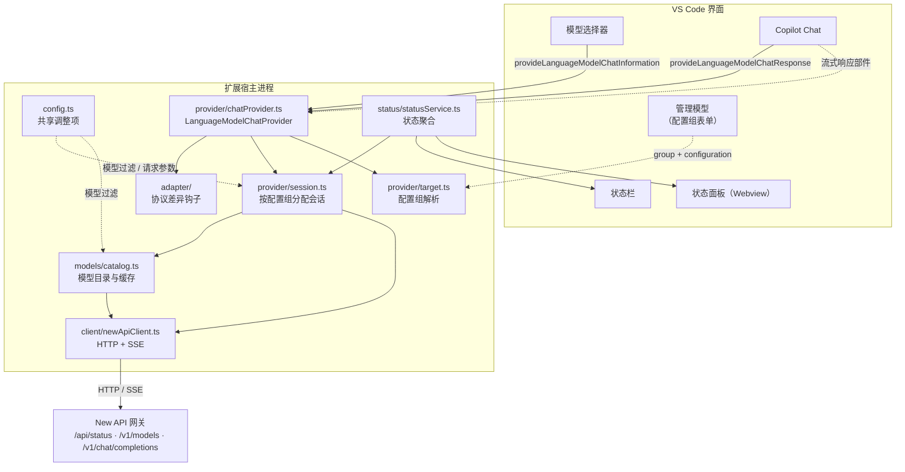
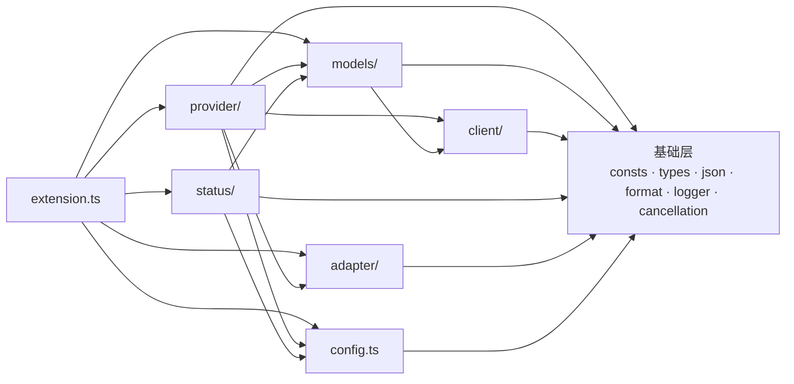

# 架构说明

面向要修改这个代码库的人：**代码在哪**、**为什么这么分层**、**改动某类需求要动哪里**。
使用者的功能与配置说明见 [`README.md`](../README.md)。

## 1. 这个扩展在做什么

把 [New API](https://github.com/QuantumNous/new-api)（OpenAI 兼容网关）里的模型，作为
**自带密钥（BYOK）**的语言模型供应商注册给 GitHub Copilot Chat。实现的是 VS Code 的
`LanguageModelChatProvider`（发现模型、处理请求、估算 token），难点不在接口本身，而在接口两侧的落差：

| 落差 | 具体表现 |
| --- | --- |
| **模型元数据缺失** | `/v1/models` 通常只返回 `id`；而 VS Code 需要上下文窗口、输出上限、图片/工具能力 |
| **消息模型不同** | VS Code 只有 User / Assistant 两种角色、工具结果挂在用户消息里；OpenAI 兼容协议有 `system` 与独立的 `role: 'tool'` 消息 |
| **配置来自 VS Code** | 站点与密钥由 VS Code 的 provider 配置组下发，且同一供应商可以有多个组 |
| **上游实现不一致** | 思考字段名、`max_tokens` 与 `max_completion_tokens`、推理模型不接受 `temperature` 等 |

代码结构就是分别处理这四个落差。

## 2. 总体数据流



一次对话请求的完整路径：

1. Copilot Chat 选中某个模型 → 调用 `provideLanguageModelChatResponse(model, messages, options, progress, token)`。
2. provider 用 `model.targetKey` 找回**模型所属配置组**的会话（多站点时这一步很关键）。
3. `provider/messages.ts` 转成 `/v1/chat/completions` 的请求体，`adapter.transformRequest` 按模型改写（当前是恒等变换）。
4. `client` 发起流式请求，SSE 逐块解析。
5. `provider/stream.ts` 把 chunk 翻译成 `LanguageModelTextPart` / `LanguageModelToolCallPart` 并上报 `progress`。
6. 结束时把上游 `usage` 交给 `status` 统计。

## 3. 代码地图

| 文件 | 行数 | 职责 |
| --- | ---: | --- |
| `extension.ts` | 324 | 激活与装配。**只做接线**，读它能看清整体数据流 |
| **基础层** | | |
| `consts.ts` | 162 | 命令 ID、端点、默认值、思考强度键名、运行时版本 |
| `types.ts` | 268 | New API / OpenAI 兼容（DeepSeek 风格）数据结构 |
| `json.ts` | 174 | 安全解析、类型收窄、按键取候选值 |
| `format.ts` | 83 | token / 时长 / 相对时间格式化、Markdown 转义 |
| `logger.ts` | 282 | `LogOutputChannel` + 级别闸门 + 密钥脱敏 |
| `cancellation.ts` | 67 | `CancellationToken` → `AbortSignal` 桥接 |
| **`client/`** 与 New API 交互 | | |
| `http.ts` | 423 | 超时、重试退避、信号合并、错误分类（`HttpError` / `TransportError`） |
| `sse.ts` | 251 | SSE 解析、静默超时、非 SSE 降级读取 |
| `newApiClient.ts` | 403 | 端点封装、模型列表解析、失败建议 |
| **`models/`** 模型信息整合 | | |
| `dataset.ts` | 233 | 模型数据表（`data/openrouter-models.json`）：校验、索引与查找 |
| `matcher.ts` | 46 | 极简 glob 匹配与 include/exclude 判定 |
| `modelConfig.ts` | 579 | 多来源合并、一致性校正、远端字段提取 |
| `tooltip.ts` | 119 | 悬浮窗 Markdown（身份行 + 规模与能力逐项一行、键值分列） |
| `catalog.ts` | 218 | 拉取编排、缓存、并发合并、失败降级 |
| **`provider/`** 与 Copilot 交互 | | |
| `target.ts` | 125 | 解析 VS Code 下发的配置组 + 配置指纹 |
| `session.ts` | 169 | 按配置组缓存 client + catalog |
| `chatProvider.ts` | 439 | 实现 `LanguageModelChatProvider` |
| `modelConfiguration.ts` | 161 | 模型级配置（思考强度）：schema 生成、取值解析、写进请求体 |
| `messages.ts` | 334 | VS Code ⇄ OpenAI 兼容的消息转换 |
| `stream.ts` | 272 | 流式 chunk → 响应部件（工具调用分片合并、思维链） |
| `tokenizer.ts` | 108 | token 估算（刻意高估） |
| **`adapter/`** 差异出口 | | |
| `adapter.ts` / `registry.ts` / `defaultAdapter.ts` | 196 | 钩子接口、注册与解析、恒等实现 |
| **`status/`** UI | | |
| `statusService.ts` | 352 | 状态的唯一真相来源，按配置组聚合 |
| `usage.ts` | 101 | 会话用量的读出：缓存命中与思维链 token、各网关字段名兼容 |
| `statusBar.ts` | 211 | 状态栏渲染（悬浮提示 = 本次会话消耗，空闲时不弹） |
| `panel.ts` | 633 | Webview 面板（HTML + 手写 DOM 脚本） |
| **测试** | | |
| `test/*.test.ts` + `test/helpers.ts` | 1,799 | 140 个用例，只覆盖纯函数与装配 |

## 4. 分层与依赖方向



刻意维持的约束：

- **`client` 只在运行时依赖基础层**：它用 `AbortSignal` 而不是 `CancellationToken`，网络逻辑不绑死在 VS Code 上。
- **`models` 是纯数据转换**：不注册命令、不发请求（`catalog` 只调用注入的 client），因此能被单测直接覆盖。
- **`provider` 不直接构造 client**：一律通过 `SessionRegistry` 拿会话，多站点隔离与配置变更时的重建只有一处实现。
- **`status` 只做聚合与渲染**，从不自己发请求。
- **`extension.ts` 不含业务逻辑**，是唯一知道「怎么把模块拼起来」的地方。

## 5. 基础层

- **`consts.ts`**：只放**不随用户配置变化**的字面量。用户可改的值必须先在 `package.json` 的
  `contributes.configuration` 声明、再由 `config.ts` 读取；站点与密钥是另一类，声明在
  `contributes.languageModelChatProviders[].configuration` 里，只在 `provider/target.ts` 读取。
  `VENDOR_ID` 要与三处保持一致（贡献点、激活事件 `onLanguageModelChatProvider:<vendor>`、注册调用）；
  `runtimeInfo` 在 `activate()` 时由 `package.json` 的版本填充，避免版本漂移；
  `MANAGE_MODELS_COMMAND` 是 VS Code 内置的「管理语言模型」界面，配置引导都指向它。
- **`types.ts`**：以 OpenAI Chat Completions 为基准，**服务端字段一律可选**（网关版本、上游模型、
  代理层都可能裁字段），无法穷举的字段交给索引签名兜底。
- **`json.ts`**：把「解析不可信数据」的防御性代码收敛到一处，刻意**不抛异常**
  （`safeJsonParse` 失败返回 `undefined`）；`pickString` / `pickNumber` / `pickBoolean` 按候选键名取值，
  兼容同一语义在不同网关上的多种字段名。
- **`logger.ts`**：基于 `LogOutputChannel`，用户可在「输出」面板直接调级别。两个要点：我们自己的级别闸门
  与通道级别是**两回事**，配得比通道更详细时日志会被通道吞掉，`warnIfChannelLevelBlocks()` 会检测并提示；
  `redactText` 用正则兜底脱敏，**即使调用点忘了 `redactSecret`，密钥也不会整串落进日志**。
- **`cancellation.ts`**：`CancellationToken` → `AbortSignal` 的集中转换，请求结束后 `dispose()` 解除监听。

## 6. `client/` —— 与 New API 交互

**超时**（`http.ts`）：非流式是**整体超时**（连接 + 读取）；流式的 `timeoutMs` 只作为「等响应头」的上限，
响应体开始到达后交给 `sse.ts` 的**静默超时**。流式若套用整体超时，正常但很长的回答会被误杀；
按「两个数据块之间的空闲时间」判定则长回答（持续吐字节）不受影响，真正卡死的连接会及时断开。
`createSignalGuard` 把「调用方信号 + 超时 + 客户端释放」合并成一个 `AbortSignal`，并记录是否由超时触发。

**重试**：只重试网络错误、超时与 `408` / `409` / `425` / `429` / `5xx`；4xx 业务错误重试只会重复失败。
退避指数增长 + 抖动，并尊重服务端的 `Retry-After`。**一旦开始消费响应体就不再重试**，因为服务端可能已开始计费。

**错误分类**：`TransportError` 分 `network` / `timeout` / `aborted`（连不上 / 超时 / 用户取消）；
`HttpError` 带 `status`、服务端错误描述、`Retry-After`，并提供 `isAuthError` / `isNotFound` / `isRetryable`。
`isAbortError` 单独处理——用户点「停止」是正常流程，不该当失败上报。

**`sse.ts` 的容错点**：三种换行符都支持、`:` 开头的心跳注释行忽略、流结束时不带结尾换行的残留事件也会处理、
单个 chunk 解析失败只记日志并跳过（网关偶尔插入非 JSON 的心跳行）。

**非流式降级**：网关忽略 `stream: true` 而返回普通 JSON 时，`newApiClient` 检测 `content-type` 并把非流式响应
**包装成一个等价的 chunk**，让上层只处理一种形态；否则 SSE 解析器会把整段 JSON 当成一行无效数据而什么都拿不到。

**连通性由状态服务组织**：`client` 只有两件原子能力——`listModels()` 与 `getStatus()`（失败不抛异常，
因为 `/api/status` 是 New API 的自有扩展，第三方兼容网关通常没有它）。`StatusService.refreshSession()`
把它们拼成「这个站点现在怎么样」：模型列表走 `catalog`（与 provider 共享缓存，因此状态里的数量就是模型选择器里的数量），
站点信息走 `getStatus` 并用时耗作为延迟，失败时由 `describeFailureHint()` 给出**可操作建议**
（地址写错 / 密钥被拒 / 被限流 / 需要代理）而不是只丢一个错误字符串。只有一处发起探测，
因此状态栏、面板与「测试连接」命令的口径天然一致。

## 7. `models/` —— 模型信息整合

优先级：**① 网关返回的扩展字段（remote）> ② 随包数据表按 ID 查表（dataset）> ③ 兜底默认值（default）**。
越靠前的越可信：网关最清楚自己那条链路，数据表只是生成时的快照（同一模型在不同中转上的窗口确实可能不同）。
两者显著不一致时以网关为准，并把这个事实写进**日志**（debug 级）；`resolveModelConfig` 把每个字段的
来源记进 `meta.provenance`，由**状态面板**的「窗口来源」列展示——用户看到数值不符时能知道该不该相信它。

**模型信息有三个出口，各管一段**：tooltip 回答「这是什么模型、能干什么」（一行身份 `id · vendor`，
再逐项列出规模与能力）；面板回答「这个数值从哪来」（来源列）；日志回答「为什么是这个值」
（网关覆盖了数据表、数值被校正）。tooltip 里刻意不堆解释：来源、档位、校正提醒各有归属，
塞进来只会把「鼠标一掠」变成读一张表。

**选择器里的主名是展示名**：`ModelConfig.name` 取 `displayName ?? id`，`id` 单独留在 `id` 字段里
回传请求。VS Code 的列表行把 `name` 当主文字、`detail`（`vendor · 窗口 · 工具`）当副标题，
拿 ID（`anthropic/claude-sonnet-4.5`）当主名没人愿意读。随包数据表里 343 条展示名互不重复，
所以同名混淆不会出现；网关只给 ID 时回退到 ID，界面不会出现空名字。

**tooltip 不写标题**：悬浮卡片自己会渲染模型名（即上面的展示名），重复写就是两行同一个东西。
身份行改用 `id`（回传给站点的那个名字、等宽字体）——它才是能拿去搜站点文档、对账单的字符串，
正好与卡片标题互补。

**tooltip 的排版按传播环境定**：VS Code 在模型悬浮卡片里把 tooltip 当 Markdown 渲染，
容器只有 `max-width: 300px`、`font-size: 12px`，且 `p { margin: 0 }`。因此**一项一个段落**
（空行分隔，靠零段落间距贴紧成清单），不用 `·` 把多项串成一行——那样折行位置取决于宽度，
在 300px 里会把「输入上限」和「图片输入」折到同一行上。单 `\n` 不行：Markdown 的软换行会被折叠成空格。

**键与值分列**（`padLabel`）：标签长短不一（`思考` / `上下文窗口`）时取值会参差，因此标签用
**全角空格**补到等宽，再另加一个全角间隙。选全角空格是因为中文与它等宽，在比例字体里也能对齐；
半角空格会被 Markdown 折叠、宽度也只有汉字的三分之一，补不出列宽。

**例外是思考能力**：远端只能给出「肯定」，因此**数据表先落地、网关的肯定最后覆盖**——既不会把表里
已知的能力抹掉，也不会因为表里写了 `false` 而隐藏站点声明支持的选项。

### 一致性校正

三路来源合起来容易出现自相矛盾的数值（例如窗口 8K 却声称输出 16K）。`reconcileLimits` 统一收敛：
`maxInputTokens + maxOutputTokens <= contextWindow`、输出上限不挤占输入空间（至少给输入留 1/4 窗口）、
各项不低于合理下限。每次修正都收集到 `adjustments` 里，最后由 `resolveModelConfig` 写成一行 `debug` 日志
（`reconcileLimits` 自身不碰 logger，保持纯函数）——**静默修正数值比不修正更糟**，被下调的数字
必须在日志里查得到原因。这也是测试唯一能断言「校正留下了痕迹」的地方，因此测试辅助里有
`capturingLogger()`（覆盖 `LoggerService.write` 收集日志行）。

### 远端字段提取

`extractRemoteHints` 覆盖实际观察到的几种风格：New API / one-api 的 `context_length`、
OpenRouter 的 `top_provider.max_completion_tokens` 与 `architecture.input_modalities`、
vLLM 的 `max_model_len`、通用的 `supports_vision` / `capabilities.*`。

两处刻意的保守：New API 会返回语义含糊的 `max_tokens`（可能是输出上限，也可能被上游当成上下文长度），
**不据此臆测上下文窗口**，只当作输出上限；`supported_parameters` 里出现 `reasoning` 等参数说明支持，
但**没出现不说明不支持**（New API 压根不返回该字段），因此远端只能把它置为 `true`——
想关掉某个模型的思考选项得从数据表（即生成脚本）入手。

### 模型数据表（`dataset.ts` + `data/openrouter-models.json`）

随包发布的 JSON（约 340 条），由 `npm run models:openrouter` 从公开模型目录生成，
`extension.ts` 在激活时用 `readFileSync` 读入，`dataset.ts` 负责校验、建索引与查找。
`ModelDatasetEntry` 里只有 `vendor` / `displayName` / `reasoning` / `supportsReasoningEffort` /
`defaultReasoningEffort` 可选，其余字段由脚本固定写出（它不是手工维护的文件，
「缺字段」因此不是需要兼容的常态）；思考字段只在**上游确实给出**时才写——只有 `mandatory` /
`default_enabled` 的模型「会思考但不能调强度」，没有可选档位，也就不会有控件。

生成脚本的上游字段对应关系（更多细节见脚本头注释）：

| 上游 | 数据表 |
| --- | --- |
| `top_provider.context_length` | `contextWindow` |
| `top_provider.max_completion_tokens` | `maxOutputTokens` |
| `architecture.input_modalities` | `imageInput` |
| `supported_parameters`（`tools`） | `toolCalling` |
| `supported_parameters`（`reasoning`）+ `reasoning` 对象 | `reasoning` |
| `reasoning.supported_efforts` | `supportsReasoningEffort` |
| `reasoning.default_effort` | `defaultReasoningEffort` |

**它是生成产物，扩展只读**：没有「用户覆盖」设置项，也没有打开/监听数据表的命令——否则就变成
「两份需要同步的数据」或「一份不知道谁改过的数据」。要更新数据就重跑生成脚本
（`data/` 随包发布，见 `.vscodeignore`），要修个别模型就改生成脚本或上游数据源。几个关键取舍：

- **不做成源码里的常量表**：几百条数据且持续变动，独立文件让更新数据不必改代码，数据也不进 TypeScript 编译。
- **数据是不可信输入**：缺 `id`、或缺正数 `contextWindow` / `maxOutputTokens` 的条目在载入时丢弃并计数
  （日志会说明丢了多少条），单条坏数据不会让整张表失效。
- **匹配从精确到宽松**：表里的 `id` 已规范化，而网关 ID 常带渠道与日期后缀
  （`gpt-4o@official`、`gpt-4o-2024-08-06`）；先精确命中，命中不了才逐层剥厂商前缀、变体、渠道、
  日期后缀。「先精确」保证 `gpt-4o-2024-08-06` 不会挑中 `gpt-4o`。
- **载入失败不沿用旧数据**：文件缺失或不是合法 JSON 时显式清空（`installModelDataset(undefined)`），
  宁可退回「网关返回值 + 默认值」。

### 缓存与失败降级（`catalog.ts`）

- **并发合并**：短时间内的多次模型发现用一个 in-flight promise 合并成一次请求。
- **stale-while-error**：成功过就用旧数据 + 错误标记，用户已经看到的模型不该因为网关抖动而消失。
- **失败不缓存空结果**：从未成功过时**不写 snapshot**，改用 10 秒退避——否则一次瞬时失败会把
  「没有模型」缓存住整个 TTL，选择器空空如也却找不到原因。
- **不接入调用方的 CancellationToken**：VS Code 会在 UI 更新后立即取消
  `provideLanguageModelChatInformation` 的 token（例如模型选择器收起），接上共享的模型列表请求后
  一次取消会连带取消其他调用方。因此 provider 层不传该参数，超时与并发合并统一由 catalog 管理。

## 8. `provider/` —— 与 Copilot 交互

### 配置组解析（`target.ts`）

配置完全由 VS Code 提供：`package.json` 的 `configuration` 贡献点是一份 JSON Schema，
VS Code 据此在「管理模型」界面生成表单，并把解析好的值随调用传进来：

```ts
provideLanguageModelChatInformation({ group, silent, configuration }, token)
```

`createTarget` 把它归一成 `ProviderTarget`（规范化的 `baseUrl` + 明文 `apiKey` + 配置指纹 + 问题列表），
之后的 client / catalog 只认这一种输入。标了 `secret: true` 的 `apiKey` 由 VS Code 存入系统钥匙串，
传入时已解析回明文；同一供应商可以有多个配置组（多个站点），组名用于区分。

**`key` 是配置指纹（FNV-1a），绝不包含明文密钥**——它会作为 Map 键并出现在日志里。
`baseUrl` 被 `normalizeBaseUrl` 归一（该函数幂等，因此不依赖调用方预处理）。
stable 的 `PrepareLanguageModelChatModelOptions` 只声明了 `silent`，因此
`readOptionsGroup` / `readOptionsConfiguration` 做运行时探测；拿不到就返回「本次调用未携带配置」，
provider 相应地不提供模型。

### 会话隔离（`session.ts`）

按目标维护一份 `{ client, catalog }`：**不能全局共用**（否则 A 站的模型列表会串到 B 站），
也**不该每次新建**（VS Code 会反复轮询，每次新建 client 会不断建立新连接）。**槽位是组名**，
同一槽位只保留一个会话，配置指纹变了就重建旧的——旧 client 的 `dispose()` 会中断在途请求，
避免拿到按过期配置发出的响应，Map 因此也不会堆积。响应阶段靠 `find(key)` 用模型上带的指纹找回会话，
**找不到时不能退回默认目标**（那会把 A 站的模型拿去 B 站请求）。

模型信息里只挂**指纹与标签**，不挂目标本体：这些字段会随模型元数据长期留在 VS Code 的模型缓存里，
而 `ProviderTarget` 含有明文 API Key。

### 模型发现（`chatProvider.ts`）

`options.silent === true` 时**绝不弹任何 UI**——那是 VS Code 在问「现在有没有可用模型」，
每次打开模型选择器都会调用一次，弹窗会变成骚扰。模型列表加载失败时**不向外抛异常**，
而是返回空数组（表现为「没有模型」），由状态栏与面板负责告诉用户原因。

`toModelInformation` 通过泛型 `LanguageModelChatProvider<T>` 把内部 `ModelConfig` 一并交给 VS Code
——它会把这个对象原样传回响应方法，因此响应阶段能拿到已解析的能力与窗口。

### 模型配置：思考强度（`modelConfiguration.ts`）

provider 可以随模型信息下发一份 `configurationSchema`，VS Code 据此在模型选择器里渲染出**模型级控件**，
用户选定的值在下次请求时随 `options.modelConfiguration` 交回。本扩展用它暴露「思考强度」——
需要逐个模型调整的旋钮只有这一个。

> **控件的数据源必须由 provider 自己声明**：`chatLanguageModels.json` 里的
> `supportsReasoningEffort` / `defaultReasoningEffort` 换来的控件**只对内置 Copilot 的 BYOK 供应商生效**
> （`customoai` / `customendpoint` 等）——核心把已知供应商列成白名单，其余第三方一律映射成 `3p-extension`；
> 渲染路径（`getModelConfigurationActions` → `_renderChoiceSection`）要求 `configurationSchema.properties`
> 存在且属性带 `enum`，否则不渲染。内置供应商把这份 schema 从配置文件的模型条目里合成，
> 本扩展从随包数据表合成——机制相同，数据来源不同。

流程：

```
数据表 supportsReasoningEffort ──▶ ModelConfig.reasoningEfforts
数据表 defaultReasoningEffort  ──▶ ModelConfig.defaultReasoningEffort ──▶ schema 的 default
ModelConfig.reasoning ──▶ buildModelConfigurationSchema()  ──▶ configurationSchema（下发给 VS Code）
用户在选择器里选一个值（默认预选 = defaultReasoningEffort）
options.modelConfiguration ──▶ selectReasoningEffort() ──▶ applyReasoningEffort() ──▶ 请求体
                                └─ 等于默认档位则不发送
                                                          └──▶ AdapterContext.reasoningEffort
```

几个踩点：

- **属性必须带 `enum`** 才会被渲染成控件；`group: 'navigation'` 决定它出现在模型卡片的主控件区。
- **`default` 取数据表的 `defaultReasoningEffort`**：VS Code 据此在控件里预选该档位，并把它合并进模型配置
  （`_resolveModelConfigurationWithDefaults` 总是 `{...defaults, ...stored}`），于是每次请求都会带着它。
  但预选只是让界面反映现状，因此 `selectReasoningEffort` 把**等于默认档位**当作「未修改」、**不发送**该字段。
  数据表没给默认档位时不声明 `default`，控件空选中，用户选什么都算明确意图、照发。默认值还必须落在
  `enum` 里，否则会预选一个不存在的档位——这条不变量在 `resolveModelConfig` 里守住（不在列表就当作没有）。
- **档位逐模型且没有兜底**：候选项就是 `config.reasoningEfforts`（不拼接任何占位项），**列表为空时不声明
  schema**——「会思考但不知道能调哪些档」时，凭空造一组值只会发出站点不认的请求。
- **选项不经翻译**：只声明 `enum`（不声明 `enumItemLabels` / `enumDescriptions`），控件里显示的就是数据表
  原值（`max` / `xhigh` / `minimal` / `none` …）；自己维护一套映射，一旦出现新档位就会显示一个猜出来的名字。
- **取值按当前模型校验**：不在 `config.reasoningEfforts` 里的选择会被拒绝并记一条警告，而不是默默发出去
  ——静默发出站点不认的取值，用户只会看到一句无从排查的报错。
- **字段名是常量 `reasoning_effort`**，不逐模型可配：网关用别的叫法（例如 `reasoning.effort`）或需要嵌套
  形态时交给适配器层改写。`applyReasoningEffort` 会拒写 `PROTECTED_REQUEST_KEYS`（`model` / `messages` …）。
  默认强度同时写进属性的 `description`（「默认 high（来自模型数据表）」），
  并随 `AdapterContext.reasoningEffort` 传给适配器。

`modelOptions` 与 `modelConfiguration` 都不是 stable typings 的字段，因此做运行时探测；
通过扩展 API 直接调用模型的调用方写的是前者，且优先级更高。

### 消息转换（`messages.ts`）

| 概念 | VS Code | OpenAI 兼容 |
| --- | --- | --- |
| 角色 | 只有 `User` / `Assistant` | `system` / `user` / `assistant` / `tool` |
| 工具调用 | 助手消息里的 `LanguageModelToolCallPart` | 助手消息的 `tool_calls` |
| 工具结果 | 用户消息里的 `LanguageModelToolResultPart` | **独立**的 `role: 'tool'` 消息，带 `tool_call_id` |
| 图片 | `LanguageModelDataPart`（mimeType + Uint8Array） | `image_url`，URL 为 `data:` 形式 |

因此一个 VS Code 消息可能被拆成**多条**上游消息，且顺序敏感：`assistant(tool_calls)` 之后
必须紧跟若干条 `tool` 消息，顺序错了上游会直接报 400。其他细节：带 `tool_calls` 时 `content` 必须为 `null`；
`system` 角色由「用户消息 + `name === 'system'`」启发式识别（VS Code 的消息模型没有 system 角色）；
未知部件尽力转成文本而不是丢掉（丢掉会让模型失去上下文）。

### 流式翻译（`stream.ts`）

- **工具调用分片到达**：`function.arguments` 会被切开，必须按 `index` 归并、按到达顺序拼接，最后才能 parse。
  **统一在流结束时上报**——只有那时才能确定参数拼完整了。解析失败返回空对象而不是抛异常，
  让 VS Code 报出参数校验失败（模型可自我修正），比丢掉这次工具调用更好；上游偶尔把 JSON 包在
  Markdown 代码块里，会被自动剥离。
- **思维链有两种字段名**：DeepSeek 用 `reasoning_content`，OpenRouter 等用 `reasoning`。
- **usage 只在最后一个 chunk**：单独记下用于统计。
- **多 choice**：VS Code 的响应模型是单条回答，只取 `index === 0`（对 `n > 1` 给出警告）。

### Token 估算（`tokenizer.ts`）

拿不到目标模型的真实分词器（各家不同、网关也不暴露），只能估算：CJK 按 1 字符 ≈ 1 token、
其余按 4 字符 ≈ 1 token，再加消息 / 工具 / 图片的固定开销。**偏差方向是有意选择的**：宁可高估——
高估会让 VS Code 更早裁剪历史，代价只是少一点上下文；低估则会把超长请求发给上游而被拒绝。

## 9. `adapter/` —— 协议差异的出口

不同上游对 OpenAI 协议的实现并不一致：推理模型不接受 `temperature` 且只认 `max_completion_tokens`；
思考开关的字段名各异（`enable_thinking` / `thinking` / `reasoning_effort`）；有的网关不支持
`tool_choice: required`，必须降级成 `auto`。这些差异若全写进 provider，会散落大量
`if (model.id.startsWith(...))`，`ModelAdapter` 就是它们的唯一出口，三个可选钩子：

| 钩子 | 时机 | 典型用途 |
| --- | --- | --- |
| `transformRequest` | 请求发出前 | 删除不支持的参数、补充网关专属字段 |
| `transformChunk` | 每个流式 chunk | 统一字段名、合并分片 |
| `finalize` | 流结束 | 冲刷适配器内部缓冲 |

目前只注册了恒等变换的 `DefaultModelAdapter`，它的三个钩子刻意都不实现——钩子未定义时 provider
直接透传，效果就是恒等变换；保留空实现反而多出无意义的调用与拷贝。`AdapterRequestState` 把跨 chunk
的累积状态显式传入，而不是让适配器持有实例字段，这样同一个适配器实例可以被多个并发请求安全复用。

## 10. `status/` —— 状态栏与面板

**分工：状态栏讲「这一次花了多少」，面板讲「站点与模型是什么样」。** 状态栏只有一格、鼠标一停就要
给出答案，因此悬浮提示只放本次会话的用量：请求次数、工具调用、输入/输出 token、缓存命中、
最近一次请求的模型；站点地址、网关版本、延迟、模型数量、列表来源这些**站点细节全在面板**里
（那里铺得开，还能手动刷新）。

提示只在**有话可说**时出现（`buildTooltip` 返回 `undefined` 就不设 `tooltip`，VS Code 连悬浮框一起省掉）：
有会话用量、或有问题需要处理、或站点都没配置。空闲时悬停给一句「还没有请求」是纯噪声，
还容易被当成扩展出错；状态栏文本自己就说明了可用性。唯一留在提示里的站点信息是
**「哪里出了问题」**——状态栏此时已被着色，用户需要一个理由，所以配置不完整与连不上的站点
会各占一行（带可操作建议）。

- **状态栏**文本极短（`$(cloud) 12 模型`），只在需要用户行动时着色（尚未配置、或已配置的站点连不上），
  避免变成常亮的警告灯。
- **面板**回答「为什么」：各配置组的状态与细节、模型清单（含每个数值的来源）、被过滤的模型、
  会话用量、适配器链、日志入口。

### 会话用量（`usage.ts`）

只做算术、不碰 UI，因此可以被单测直接覆盖。需要在这层吸收三类差异：

- **缓存命中的字段名不统一**：OpenAI / New API 放在 `prompt_tokens_details.cached_tokens`，
  DeepSeek 用 `prompt_cache_hit_tokens`，两者都认。
- **总量与分项可能缺一个**：互为兜底。命中数会被钳到输入量以内，否则上游一次自相矛盾的返回
  就能显示出「命中 200%）」这种数字。
- **`usage` 可能整个缺失**（流式请求尤其常见，除非显式要求）。「没报告」与「报告了 0」必须区分：
  `cacheReported` 只在响应真的带了缓存字段时为 `true`，否则界面会显示一个不存在的「命中 0」。
  同理，总 token 为 0 时不显示一行 0，而是说明上游未返回。

命中率的分母是**输入**（缓存只作用于 prompt，拿总量当分母会得到偏低的假数字），
文案由 `describeCacheHit` 统一产出，状态栏与面板口径因此一致。

配置组可以有多个，因此状态是**按目标聚合**的：`targets` 每个元素对应一个组，整体可用性取
「是否存在任一可用目标」（`anyUsable`），状态栏的模型数是各组之和。这样某个组临时挂掉只会让那一行
标为不可用，而不是整块状态栏变红；配置不完整（缺地址/缺密钥）时也能精确定位到是哪个组。

面板只在打开时存在，但状态变化可能频繁，因此 HTML 骨架只生成一次、状态通过 `postMessage` 增量下发
（避免重建 DOM 导致滚动位置丢失），上百条的模型清单不放进每次下发的 state 而是随状态按需下发。
**Webview 脚本全部用 DOM API 构造节点**（`textContent` + `h()` 辅助函数），不拼 innerHTML——
模型 ID、站点名都来自外部，拼字符串必然要处理转义，而转义写错就是注入漏洞。CSP 为
`default-src 'none'`，样式与脚本用 nonce 放行。

## 11. 常见改动该动哪里

- **补一个模型的元数据**：改数据而不是改代码——跑 `npm run models:openrouter` 重新生成
  `data/openrouter-models.json`。上游目录里没有这个模型时改生成脚本（加个别名或回退取值），
  不要手工往文件里加条目，下次生成会全部覆盖。
- **让某个模型的行为不一样（新增适配器）**：实现 `ModelAdapter`（`supports()` 判断是否命中）→
  在 `adapter/registry.ts` 的 `createDefaultAdapterRegistry()` 注册（`priority` 高者先匹配）→ 加测试。
  **不需要改 provider**——这是这一层存在的意义。
- **新增设置项**：`package.json` 的 `contributes.configuration.properties`（类型、默认值、说明）→
  `src/config.ts` 的 `readSettings()` 读取并收敛（非法值记录并回退，不要让整份配置失效）→ 在对应的
  Settings 接口加字段 → 影响模型配置则改 `models/modelConfig.ts`，影响请求则改 `chatProvider.buildRequest`。
- **新增模型级配置项（选择器里的控件）**：它不是设置项，而是随模型信息下发的 schema——
  `models/modelConfig.ts` 把能力纳入 `ModelConfig`（写 `meta.provenance`，遵从 §7 的优先级）→
  `provider/modelConfiguration.ts` 在 `buildModelConfigurationSchema()` 加属性、在取值侧加解析
  （带 `enum` 才会被渲染）→ `chatProvider` 的 `buildRequest` 写进请求体 → 有默认项就写进 schema 的
  `default`（并保证它在 `enum` 里）→ 补测试与面板展示。
  注意「支持该能力」与「有可选项」是两件事：没有可选项时同样不声明 schema（见 §8 思考强度）。
- **新增配置组字段（站点 / 密钥类）**：这类字段**不是**设置项，声明在
  `contributes.languageModelChatProviders[].configuration` 里——`package.json` 加字段（密钥类 `secret: true`）
  → `src/provider/target.ts` 的 `createTarget()` 读取并校验，写入 `ProviderTarget` 与 `issues`
  → 若影响连接身份还要纳入 `key` 指纹（否则配置改了会复用旧会话）→ 需要的话经 `session.ts` 传给 `NewApiClient`。
- **新增命令**：`consts.ts` 的 `COMMANDS` 加键 → `package.json` 的 `contributes.commands` 加条目 →
  `extension.ts` 里 `registerCommand`。
- **新增一个探测 / 展示字段**：`client/newApiClient.ts` 的 `getStatus` / `ModelCatalogSnapshot` →
  `status/statusService.ts` 的 `TargetStatus` → `panel.ts` 渲染（站点细节都在面板；
  只有「需要用户动手的问题」会同时出现在状态栏悬浮提示里）。**会话用量的字段**则走
  `status/usage.ts` 的 `UsageDelta` → `UsageStats` → 状态栏与面板两处。
  注意面板脚本是**字符串里的 JS**，不受 TypeScript 检查。

## 12. 已知取舍

| 取舍 | 原因 |
| --- | --- |
| 思考内容只能作为正文回显，包成 Markdown 引用块 | 稳定的 VS Code API 没有「思考内容」响应部件 |
| 思考强度默认「不指定」，用户选过才发 | VS Code 会把 schema 的 `default` 带进每一次请求，不能替用户改请求 |
| 思考档位逐模型且**不经翻译**（直接用上游的 `max` / `xhigh` / `minimal` / `none` …） | 上游词汇就是站点文档里的写法；编一套映射只会在出现新档位时显示一个猜出来的名字 |
| 思考强度的字段名固定 `reasoning_effort` | 数据表是生成产物，不适合承载逐模型的请求改写规则；且 VS Code 的模型配置只能从我们声明的枚举里选 |
| token 用字符数启发式估算 | 拿不到真实分词器 |
| 随包的数据表会过期 | 厂商会调整窗口与能力，重跑 `npm run models:openrouter` 即可更新；数据表只是优先级中的一环 |
| 面板脚本是手写 DOM，不用框架 | 状态量小，引入构建步骤不值得 |
| 会话用量统计是全局累加的 | 单一计数器足够回答「这次会话花了多少」 |
| 状态刷新会同时打 `/v1/models` 与 `/api/status` | 前者与 provider 共享缓存（数量一致），后者提供站点名与延迟；两个请求开销都很小 |
| 适配器层只有恒等变换的 `DefaultModelAdapter` | 接口与装配点已经就位，具体的差异处理按需添加（见 §11） |
| 网关忽略 `stream: true` 时没有逐字输出 | 只能按单块响应处理 |

## 13. 测试

`npm test` 在真实 VS Code 测试宿主中运行（`@vscode/test-cli` + `@vscode/test-electron`），
140 个用例，只覆盖**纯函数与装配**：

| 文件 | 覆盖 |
| --- | --- |
| `test/models.test.ts` | glob 匹配、family 推导、远端字段提取、配置整合与一致性校正、思考能力、批量过滤 |
| `test/provider.test.ts` | token 估算、消息转换（工具/图片/system）、工具转换与参数解析 |
| `test/modelConfiguration.test.ts` | 模型配置 schema 生成、思考强度取值解析、写进请求体（含字段名与「不声明 default」断言） |
| `test/target.test.ts` | 配置组解析、地址规范化、指纹（含「不含明文密钥」断言）、会话隔离与重建 |
| `test/extension.test.ts` | 扩展能激活、命令都注册上、缺配置时不崩 |
| `test/usage.test.ts` | 会话用量的读出：两种缓存字段风格、总量/分项互补、钳位与命中率分母 |
| `test/statusBar.test.ts` | 悬浮提示的内容约定：空闲时不弹、缓存两种缺省、分段用空行、主题图标开关 |

刻意不测的部分：真实网络交互（需要可用的 New API 站点）、Webview 渲染（需人工验收）、
VS Code 与 provider 之间的协议往返（由 VS Code 自己保证）。写新测试时注意三点：需要日志时用
`test/helpers.ts` 的 `testLogger()`（复用同一个关闭输出的通道）；`SessionRegistry` 的用例记得
`dispose()`，否则会遗留事件订阅；涉及密钥的断言应当验证**指纹与序列化结果里不含明文**。
