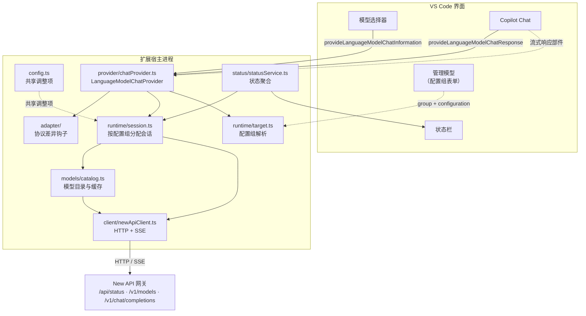
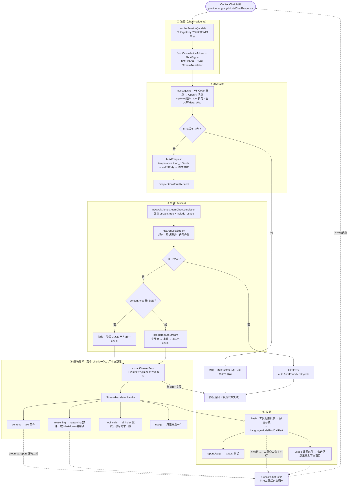
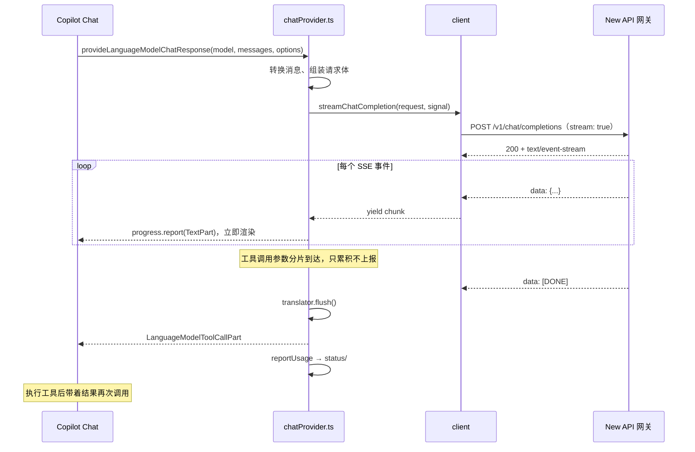
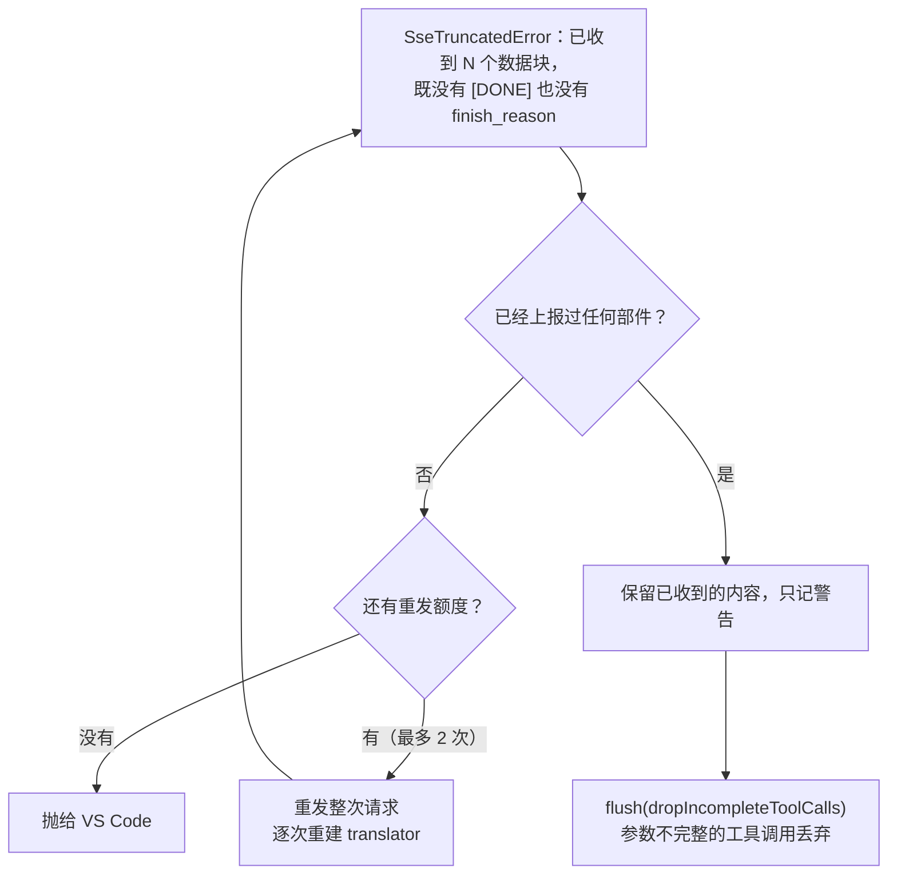
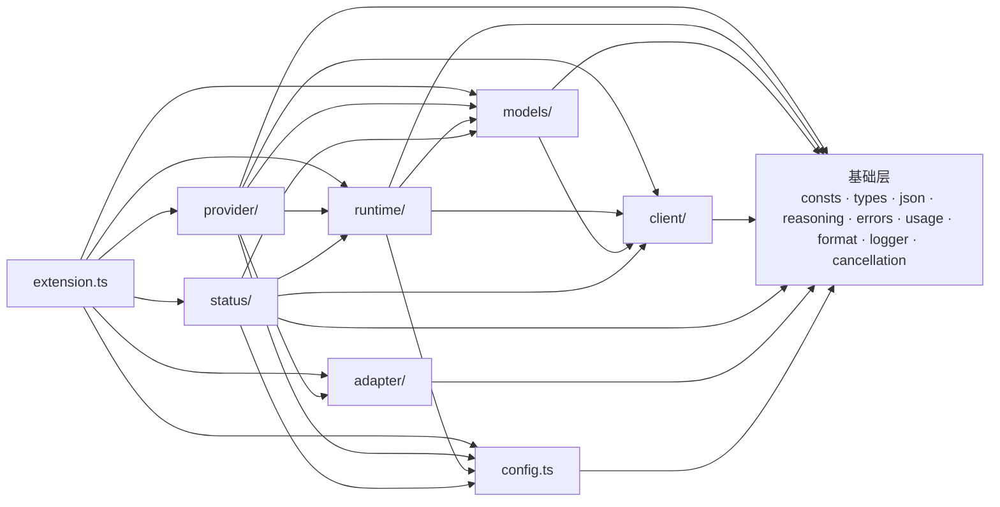

# 架构说明

面向要修改这个代码库的人：**代码在哪**、**为什么这么分层**、**改动某类需求要动哪里**。
使用者的功能与配置说明见 [`README.md`](../README.md)。

## 1. 这个扩展在做什么

把 [New API](https://github.com/QuantumNous/new-api)（OpenAI 兼容网关）里的模型，作为
**自带密钥（BYOK）**的语言模型供应商注册给 GitHub Copilot Chat。实现的是 VS Code 的
`LanguageModelChatProvider`（发现模型、处理请求、估算 token），难点不在接口本身，而在接口两侧的落差：

| 落差 | 具体表现 |
| --- | --- |
| **模型元数据缺失** | `/v1/models` 通常只返回 `id`；而 VS Code 需要上下文窗口、输出上限、图片/工具能力 |
| **消息模型不同** | VS Code 只有 User / Assistant 两种角色、工具结果挂在用户消息里；OpenAI 兼容协议有 `system` 与独立的 `role: 'tool'` 消息 |
| **配置来自 VS Code** | 站点与密钥由 VS Code 的 provider 配置组下发，且同一供应商可以有多个组 |
| **上游实现不一致** | 思考字段名、`max_tokens` 与 `max_completion_tokens`、推理模型不接受 `temperature` 等 |

代码结构就是分别处理这四个落差。

## 2. 总体数据流



### 一次请求的分阶段流程

方框标注了落点文件，可以对照代码阅读。



### 流式时序

`progress.report()` 是边收边发的：用户看到的逐字输出就来自循环内的上报，而不是等流结束。



工具调用的参数是**分片到达**的（`accumulateToolCall` 按 `index` 拼接；网关省略 `index` 时按有没有 `id`
判断「新调用」还是「续传」，续传分片接在最后一个槽位上——退回「槽位数量」当索引会让参数落进一个没有
函数名的空槽并被丢弃），中途无法解析，因此统一在 `flush()` 里上报——这也是 `LanguageModelToolCallPart`
在时序上晚于所有正文片段的原因。

### 流被掐断时的处置

上游掉连接（网关重启、代理重置）时，`client/newApiClient.ts` 抛 `SseTruncatedError`；怎么处置全看
「用户是不是已经看到过内容」：



判定抽成了纯函数 `decideStreamFailure`（`provider/stream.ts`），这样「什么时候能重发」可以被单测钉住。
「已上报部件数」由 `StreamTranslator` 统计——**只算真正 `progress.report` 出去的东西**：不回显的思维链、
还没 flush 的工具调用都不算，因为用户在界面上看不到它们，重发不会造成重复。

### 关键判定点

| 判定 | 落点 | 行为 |
| --- | --- | --- |
| 找不到模型所属的会话 | `chatProvider.ts` | 抛错提示重新选择模型（配置组已变更） |
| 转换后没有可发送内容 | `chatProvider.ts` | 抛错，不发请求 |
| 模型是 DeepSeek 且具备思考能力 | `adapter/deepseek/deepseekAdapter.ts` | 请求体写入 `thinking: { type: 'enabled' }` |
| 辅助请求（起标题、提交信息…） | `adapter/deepseek/deepseekAdapter.ts` | 改为 `thinking: { type: 'disabled' }` 并去掉 `reasoning_effort` |
| HTTP 非 2xx | `client/http.ts` | `HttpError`，按 `isAuthError` / `isNotFound` / `isRetryable` 分流 |
| 可重试的错误 | `client/http.ts` | `Retry-After` 优先，否则指数退避 + 抖动 |
| `Retry-After` 超过 30 秒 | `client/http.ts` | 不再重试，直接把带等待时间的 429 报出来 |
| `content-type` 不是 SSE | `client/newApiClient.ts` | 降级为单块 JSON，而不是静默失败 |
| 静默超时（无新字节） | `client/sse.ts` | `SseIdleTimeoutError`，与用户取消区分 |
| 流量正常结束但缺 `[DONE]` 与 `finish_reason` | `client/newApiClient.ts` | `SseTruncatedError`（半截回答不能当成功） |
| 流被掐断、还没上报过任何部件 | `provider/streamFlow.ts` | 重发整次请求（最多 2 次） |
| 流被掐断、但已上报过内容 | `provider/streamFlow.ts` | 保留已收到的内容，只记警告 |
| **站点以 400 拒绝，且响应体点名了一个可选字段** | `provider/requestRepair.ts` | 去掉那个字段重发（最多 2 轮），已试过的步骤不重复 |
| 站点以 400 拒绝，但没说清是哪个字段 | `provider/requestRepair.ts` | 不修，把上游原话交给用户（没有线索还乱改字段只会产生新问题） |
| 自愈改过请求仍被 400 拒绝 | `provider/streamFlow.ts` | 记下「去掉过什么」后照常失败（见 §8） |
| chunk 带 `error` 字段 | `provider/stream.ts` | 视为失败抛出（上游把错误塞进 200 响应） |
| 工具调用缺少函数名 | `provider/stream.ts` | 记警告并跳过 |
| 工具分片不带 `index` | `provider/stream.ts` | 按有无 `id` 判断新调用，续传分片接在同一个槽位 |
| 工具参数不是合法 JSON | `provider/stream.ts` | 先直解，再剥 Markdown 围栏；仍失败时正常结束则退化为 `{}`，流被掐断则丢弃这次调用 |
| `finish_reason === 'length'` | `provider/stream.ts` | 记警告（响应被截断） |
| 响应正常结束且有用量 | `provider/chatProvider.ts` | 回传一个 `usage` 数据部件（见 §2 末节） |
| 取消（`isAbortError` 或 token 已取消） | `chatProvider.ts` | 调试日志后静默返回，**不算失败** |
| 其它错误 | `chatProvider.ts` | `toLanguageModelError` 把面向用户的消息交给 VS Code（见 §8） |

## 3. 代码地图

| 文件 | 行数 | 职责 |
| --- | ---: | --- |
| `extension.ts` | 162 | 激活与装配。**只做接线**，读它能看清整体数据流 |
| `commands.ts` | 130 | 命令实现（测试连接 / 刷新模型 / 打开设置 / 重置用量）与「刷新后通知宿主」 |
| **基础层** | | |
| `consts.ts` | 157 | 命令 ID、端点、默认值、思考强度键名、用量部件 MIME、运行时版本 |
| `config.ts` | 245 | 共享调整项（模型缓存与兜底值、请求参数、状态栏、日志级别）的读取与校验 |
| `types.ts` | 272 | New API / OpenAI 兼容（DeepSeek 风格）数据结构 |
| `json.ts` | 174 | 安全解析、类型收窄、按键取候选值 |
| `reasoning.ts` | 48 | 思维链字段的读取与回填键名：**通用层唯一**知道各家字段名的地方 |
| `errors.ts` | 340 | 网络错误码 → 分类 → 人话，以及日志用的错误链渲染 |
| `usage.ts` | 140 | 用量的读出：缓存命中与思维链 token、各网关字段名兼容，以及回传 Copilot 的载荷 |
| `format.ts` | 67 | token / 相对时间格式化、Markdown 转义：**展示文案的唯一出口** |
| `logger.ts` | 286 | `LogOutputChannel` + 级别闸门 + 密钥脱敏 + 带上 `cause` 链的错误格式化 |
| `cancellation.ts` | 67 | `CancellationToken` → `AbortSignal` 桥接 |
| **`client/`** 与 New API 交互 | | |
| `http.ts` | 486 | 超时、重试退避、信号合并、错误分类（`HttpError` / `TransportError`） |
| `sse.ts` | 302 | SSE 解析与收尾信息、静默超时、非 SSE 降级读取、截断判定 |
| `newApiClient.ts` | 477 | 端点封装、模型列表解析、错误描述与失败建议 |
| **`models/`** 模型信息整合 | | |
| `dataset.ts` | 219 | 模型数据表（`data/openrouter-models.json`）：校验、索引与查找 |
| `remoteHints.ts` | 159 | 远端字段提取：**唯一**知道各家网关字段名的地方 |
| `limits.ts` | 93 | 窗口/输出/输入的一致性校正、显著差异判定 |
| `modelConfig.ts` | 332 | 按优先级合并三路来源，记录来源与校正说明 |
| `tooltip.ts` | 111 | 悬浮窗 Markdown（身份行 + 规模与能力逐项一行、键值分列） |
| `catalog.ts` | 215 | 拉取编排、缓存、并发合并、失败降级 |
| **`runtime/`** 连接目标与会话 | | |
| `target.ts` | 125 | 解析 VS Code 下发的配置组 + 配置指纹 |
| `session.ts` | 171 | 按配置组缓存 client + catalog |
| **`provider/`** 与 Copilot 交互 | | |
| `chatProvider.ts` | 456 | 实现 `LanguageModelChatProvider`：编排与生命周期，外加三件只服务本文件的辅助（模型信息映射、请求体组装、错误交还） |
| `modelConfiguration.ts` | 161 | 模型级配置（思考强度）：schema 生成、取值解析、写进请求体 |
| `messages.ts` | 412 | VS Code ⇄ OpenAI 兼容的消息转换（含思考内容回填） |
| `stream.ts` | 453 | 流式 chunk → **中立**响应部件的翻译（工具调用分片合并、思维链、失败处置）；不依赖 `vscode` |
| `streamFlow.ts` | 275 | 流的消费、重发门与 400 自愈循环；`ChatStreamSource` 是**传输维度的锚点**；中立部件 → 宿主部件的绑定与响应侧回传 |
| `requestRepair.ts` | 209 | HTTP 400 的自愈阶梯：去掉站点不认的那个可选字段，纯函数 |
| `tokenizer.ts` | 152 | token 估算（刻意高估，按真实用量校准比例） |
| `thinking.ts` | 69 | 思考内容部件的探测、构造与读取（宿主提供时才存在） |
| `replay.ts` | 105 | 思考内容的回放标记：随响应留下、下次请求读回 |
| `toolFlow.ts` | 178 | 工具组预激活（`activate_*`）与预激活控制流的过滤 |
| `preflight.ts` | 51 | 工具组预激活的宿主侧：与 `toolFlow.ts` 分开是为了让它保持不依赖 `vscode` |
| **`adapter/`** 差异出口 | | |
| `adapter.ts` / `registry.ts` / `defaultAdapter.ts` | 142 | 框架层：钩子接口与上下文、注册与解析、兑底与模板 |
| `deepseek/`（2 个文件） | 257 | DeepSeek：请求种类识别、思考开关与辅助请求改写 |
| **`status/`** UI | | |
| `statusService.ts` | 353 | 状态的唯一真相来源，按配置组聚合 |
| `statusBar.ts` | 210 | 状态栏渲染（悬浮提示 = 本次会话消耗 + 待处理的问题） |

## 4. 分层与依赖方向



刻意维持的约束：

- **`client` 只在运行时依赖基础层**：它用 `AbortSignal` 而不是 `CancellationToken`，网络逻辑不绑死在 VS Code 上。
- **`models` 只处理模型元数据**：不注册命令、不自己发请求；`dataset` / `tooltip` 是纯数据转换，
  `catalog` 是薄薄的拉取编排（只调用注入的 client），因此都能被单测直接覆盖。
- **`adapter` 不依赖 `config`**：适配器只需要模型配置与日志，拿不到用户设置，也就不会因设置值不同而产生
  难以复现的分支；它在 `transformRequest` 里看到的是**已经组装好的请求体**，要什么直接从那里读。
- **`runtime` 只管「目标是谁、它有哪些运行时对象」**：`target.ts` 把 VS Code 下发的配置组归一成
  `ProviderTarget`，`session.ts` 按组缓存 `client + catalog`。它既不知道 Copilot 的协议，也不渲染任何界面
  ——因此 `provider` 与 `status` 可以同时依赖它，而它不依赖两者。
- **`provider` 不直接构造 client**：一律通过 `SessionRegistry` 拿会话，多站点隔离与配置变更时的重建只有一处实现。
- **`status` 不自己构造请求**，只调用会话上已有的能力（`catalog.getModels` 与 `client.getStatus`），
  因此状态栏与「测试连接」命令看到的数据与 provider 出自同一份缓存。它对 `provider` **没有依赖**：
  需要的那点会话信息写成了结构接口（`StatusSessionSource` / `StatusSessionView`），会话注册表天然满足；
  这样状态层不必知道 Copilot 的请求流程，那点会话信息也就不会把 provider 的实现细节漏出去。
- **`status` 对 `models` 只有类型级的依赖**（读的是 `ModelCatalogSnapshot` 的形状），
  拉取与整合仍然归 `models`。
- **`usage.ts` / `reasoning.ts` 在基础层**：它们分别被 `status/` 与 `provider/`、`client/` 与 `provider/` 共用，
  放在任一侧都会让另一侧反向依赖（provider ← status 是本项目的方向）。
- **`extension.ts` 不含业务逻辑**，是唯一知道「怎么把模块拼起来」的地方。
- **这些约束有可执行的检查**：`npm run check-layering`（`scripts/check-layering.js`）维护一份
  「允许依赖宿主」的名单，名单外的文件一旦出现**运行时** `import 'vscode'` 就失败
  （`import type` 不算）。因此「`client` 不碰 vscode」「翻译层不碰 vscode」这类说法
  不会因为一次顺手 import 而静默失效。

## 5. 基础层

- **`consts.ts`**：只放**不随用户配置变化**的字面量。用户可改的值必须先在 `package.json` 的
  `contributes.configuration` 声明、再由 `config.ts` 读取；站点与密钥是另一类，声明在
  `contributes.languageModelChatProviders[].configuration` 里，只在 `runtime/target.ts` 读取。
  `VENDOR_ID` 要与三处保持一致（贡献点、激活事件 `onLanguageModelChatProvider:<vendor>`、注册调用）；
  `runtimeInfo` 在 `activate()` 时由 `package.json` 的版本填充，避免版本漂移；
  `MANAGE_MODELS_COMMAND` 是 VS Code 内置的「管理语言模型」界面，配置引导都指向它。
- **`types.ts`**：以 OpenAI Chat Completions 为基准，**服务端字段一律可选**（网关版本、上游模型、
  代理层都可能裁字段），无法穷举的字段交给索引签名兜底。
- **`json.ts`**：把「解析不可信数据」的防御性代码收敛到一处，刻意**不抛异常**
  （`safeJsonParse` 失败返回 `undefined`）；`pickString` / `pickNumber` / `pickBoolean` 按候选键名取值，
  兼容同一语义在不同网关上的多种字段名。
- **`logger.ts`**：基于 `LogOutputChannel`，用户可在「输出」面板直接调级别。两个要点：我们自己的级别闸门
  与通道级别是**两回事**，配得比通道更详细时日志会被通道吞掉，`warnIfChannelLevelBlocks()` 会检测并提示；
  `redactText` 用正则兜底脱敏，**即使调用点忘了 `redactSecret`，密钥也不会整串落进日志**。
  格式化 `Error` 时带上整条 `cause` 链（`fetch` 失败的原因全在那里，`stack` 里没有）。
- **`errors.ts`**：网络错误码 → 分类 → 人话（见 §6），同时提供日志用的错误链渲染。
  放基础层是因为日志与 `client/` 都要用它，而基础层不能反向依赖 `client/`。
- **`reasoning.ts`**：思维链字段名的**唯一**来源（读：`reasoning_content` / `reasoning`；写：回填用哪个键）。
  流式解析、非流式降级、历史回填三处都调它，于是「上游换了个字段名」只需改这一张表，
  而且三条路径不会再各自演化出不同的宽容度——这是**通用容错**，不是供应商差异，因此不放进适配器。
- **`cancellation.ts`**：`CancellationToken` → `AbortSignal` 的集中转换，请求结束后 `dispose()` 解除监听。

## 6. `client/` —— 与 New API 交互

**超时**（`http.ts`）：非流式是**整体超时**（连接 + 读取）；流式的 `timeoutMs` 只作为「等响应头」的上限，
响应体开始到达后交给 `request.streamIdleTimeoutMs`（默认 60 秒）的**静默超时**。流式若套用整体超时，
正常但很长的回答会被误杀；按「两个数据块之间的空闲时间」判定则长回答（持续吐字节）不受影响，真正卡死的
连接会及时断开。两个旋钮分开是因为它们的合理取值差得很远：缓冲型网关上长思考的模型可能长时间不吐字节，
而把「等响应头」一起放宽又会掩盖真正连不上的情况。

**超时与重试都只在客户端级配置**（`HttpClientOptions`），单次请求不能覆盖：逐个请求地调它们会让
「这个请求为什么重试了三次」变得无从推理，而实际用到的差别都在客户端这一层（模型列表、对话、站点状态）。
`createSignalGuard` 把「调用方信号 + 超时 + 客户端释放」合并成一个 `AbortSignal`，并记录是否由超时触发；
它的中断理由会**原样**成为 `fetch` 抛出的错误（据实测），所以超时文案就在那里定下。

**重试**：只重试网络错误、超时与 `408` / `409` / `425` / `429` / `5xx`；4xx 业务错误重试只会重复失败。
退避指数增长 + 抖动，并尊重服务端的 `Retry-After`。**一旦开始消费响应体就不再重试**，因为服务端可能已开始计费。
服务端要求的等待超过 30 秒时**不再重试**：等到一半再撞一次 429 只是白拖时间，而且最后的报错反而看不出真正原因。

**取消**：信号带 reason 时 `fetch` 会把 reason 原样抛出，而 `vscode.CancellationError` 的 `name` 是
`Canceled` 而不是 `AbortError`——`isAbortError` 两个名字都认，否则用户点「停止」会被当成网络故障重试几次。

**错误分类**：`TransportError` 分 `network` / `timeout` / `aborted`（连不上 / 超时 / 用户取消）；
`HttpError` 带 `status`、服务端错误描述、`Retry-After`，并提供 `isAuthError` / `isNotFound` / `isRetryable`。
`isAbortError` 单独处理——用户点「停止」是正常流程，不该当失败上报。

### 连接失败：从错误码到「该怎么办」

`fetch` 失败时外壳永远是一句 `TypeError: fetch failed`：**原因在 `cause` 里，诊断字段在它的平级属性上**
（`code` / `syscall` / `address` / `port` / `hostname`），`stack` 里没有。光看外壳只等于「连不上」，
不知道该改 DNS、端口还是证书。反过来把原始字段甩出去（`code=ENOTFOUND syscall=getaddrinfo`）同样看不懂。
所以按**错误码分若干类，每类配一句人话**（`errors.ts`），两个出口各给各的读者：

| 出口 | 形态 | 给谁 |
| --- | --- | --- |
| `getNetworkErrorMessage` | `[ENOTFOUND]（api.example.com） 域名解析失败：请确认…` | 用户（聊天界面里的报错） |
| `describeErrorCause` | `fetch failed ← getaddrinfo ENOTFOUND … code=ENOTFOUND syscall=getaddrinfo` | 日志 |

- 类别是 `dns` / `unreachable` / `interrupted` / `timeout` / `tls` / `aborted` / `protocol` /
  `configuration` / `generic`。码表不求穷尽，另有 `ERR_TLS_*` / `ERR_SSL_*` / `HPE_*` 前缀兜底。
- **码留在方括号里**：它是唯一能拿去搜索、比对的原始信息，解释只是译文。认不出的码照原样展示。
- **普通构造名不算码**（`Error` / `TypeError` → `[Error]` 等于什么也没说），
  但 `TimeoutError` / `SocketError` 这类 undici 名字是有意义的，照用。
- **原始明细只进日志**：`syscall` / `errno` 不该占用聊天框那一行。日志里的 `Error` 由 `formatArg`
  带上整条 `cause` 链，重试日志同样打原始链（那时的消息已经是给用户看的话了）。
- 主机只取 host：多站点配置下「哪个站点连不上」是第一个要回答的问题，路径与查询串没有价值。

不变量：**消息自己带建议**。无论错误是自己合成的（「响应不是合法 JSON」之类）还是从网络栈归一来的，
抛给上层时消息里就必须包含该怎么办——因此 `describeFailureHint` 对 `kind === 'network'` 返回 `undefined`。

**流是怎么结束的**：客户端要求流必须给出正常收尾信号——`[DONE]` 或某个 chunk 里的 `finish_reason`。
两者都没有、但已经解出过数据块时报 `SseTruncatedError`，而不是把半截回答当成功返回。
`parseSseJson` 用可变的 `outcome` 把「是否收到 `[DONE]`」带出来（生成器的返回值 `for await` 取不到）。
一个数据块都没解出来时不判定为截断：那种情况下分不清「响应为空」与「格式不认识」。

**`sse.ts` 的容错点**：按 `\n` 分帧并容忍 `\r\n`（行尾的回车会被削掉；单独 `\r` 不分帧）、
`:` 开头的心跳注释行忽略、流结束时不带结尾换行的残留事件也会处理、
单个 chunk 解析失败只记日志并跳过（网关偶尔插入非 JSON 的心跳行）。
非 SSE 降级路径（`readStreamText`）复用**同一套**静默超时：HTTP 层的超时守卫在拿到响应头之后就撤掉了，
这条路上必须自带超时，否则「网关忽略了 `stream`、又不吐数据」时只能等 undici 的默认 `bodyTimeout`。

**非流式降级**：网关忽略 `stream: true` 而返回普通 JSON 时，`newApiClient` 检测 `content-type` 并把非流式响应
**包装成一个等价的 chunk**，让上层只处理一种形态；否则 SSE 解析器会把整段 JSON 当成一行无效数据而什么都拿不到。

**连通性由状态服务组织**：`client` 只有两件原子能力——`listModels()` 与 `getStatus()`（失败不抛异常，
因为 `/api/status` 是 New API 的自有扩展，第三方兼容网关通常没有它）。`StatusService.refreshSession()`
把它们拼成「这个站点现在怎么样」：模型列表走 `catalog`（与 provider 共享缓存，因此状态里的数量就是模型选择器里的数量），
站点信息走 `getStatus` 并用时耗作为延迟，失败时由 `describeFailureHint()` 给出**可操作建议**
（地址写错 / 密钥被拒 / 被限流 / 上游中断）而不是只丢一个错误字符串；连接失败那一类不给建议，
因为错误消息里已经带了分类与处置（见上文）。只有一处发起探测，
因此状态栏与「测试连接」命令的口径天然一致。

## 7. `models/` —— 模型信息整合

优先级：**① 网关返回的扩展字段（remote）> ② 随包数据表按 ID 查表（dataset）> ③ 兜底默认值（default）**。
越靠前的越可信：网关最清楚自己那条链路，数据表只是生成时的快照（同一模型在不同中转上的窗口确实可能不同）。
两者显著不一致时以网关为准，并把这个事实写进**日志**（debug 级）；`resolveModelConfig` 把每个字段的
来源记进 `meta.provenance`。

**模型信息有一个出口**：tooltip 回答「这是什么模型、能干什么」（一行身份 `id · vendor`，
再逐项列出规模与能力）。来源、档位、校正提醒各有归属（日志里能看到取值与校正，
模型选择器里能选档位），塞进 tooltip 只会把「鼠标一掠」变成读一张表。

**选择器里的主名是展示名**：`ModelConfig.name` 取 `displayName ?? id`，`id` 单独留在 `id` 字段里
回传请求。VS Code 的列表行把 `name` 当主文字、`detail`（`vendor · 窗口 · 工具`）当副标题，
拿 ID（`anthropic/claude-sonnet-4.5`）当主名没人愿意读。随包数据表里 343 条展示名互不重复，
所以同名混淆不会出现；网关只给 ID 时回退到 ID，界面不会出现空名字。

**tooltip 不写标题**：悬浮卡片自己会渲染模型名（即上面的展示名），重复写就是两行同一个东西。
身份行改用 `id`（回传给站点的那个名字、等宽字体）——它才是能拿去搜站点文档、对账单的字符串，
正好与卡片标题互补。

**tooltip 的排版按传播环境定**：VS Code 在模型悬浮卡片里把 tooltip 当 Markdown 渲染，
容器只有 `max-width: 300px`、`font-size: 12px`，且 `p { margin: 0 }`。因此**一项一个段落**
（空行分隔，靠零段落间距贴紧成清单），不用 `·` 把多项串成一行——那样折行位置取决于宽度，
在 300px 里会把「输入上限」和「图片输入」折到同一行上。单 `\n` 不行：Markdown 的软换行会被折叠成空格。

**键与值分列**（`padLabel`）：标签长短不一（`思考` / `上下文窗口`）时取值会参差，因此标签用
**全角空格**补到等宽，再另加一个全角间隙。选全角空格是因为中文与它等宽，在比例字体里也能对齐；
半角空格会被 Markdown 折叠、宽度也只有汉字的三分之一，补不出列宽。

**例外是思考能力**：远端只能给出「肯定」，因此**数据表先落地、网关的肯定最后覆盖**——既不会把表里
已知的能力抹掉，也不会因为表里写了 `false` 而隐藏站点声明支持的选项。

### 一致性校正

三路来源合起来容易出现自相矛盾的数值（例如窗口 8K 却声称输出 16K）。`reconcileLimits` 统一收敛：
`maxInputTokens + maxOutputTokens <= contextWindow`、输出上限不挤占输入空间（至少给输入留 1/4 窗口）、
各项不低于合理下限。每次修正都收集到 `adjustments` 里，最后由 `resolveModelConfig` 写成一行 `debug` 日志
（`reconcileLimits` 自身不碰 logger，保持纯函数）——**静默修正数值比不修正更糟**，被下调的数字
必须在日志里查得到原因。

### 远端字段提取

`extractRemoteHints` 覆盖实际观察到的几种风格：New API / one-api 的 `context_length`、
OpenRouter 的 `top_provider.max_completion_tokens` 与 `architecture.input_modalities`、
vLLM 的 `max_model_len`、通用的 `supports_vision` / `capabilities.*`。

两处刻意的保守：New API 会返回语义含糊的 `max_tokens`（可能是输出上限，也可能被上游当成上下文长度），
**不据此臆测上下文窗口**，只当作输出上限；`supported_parameters` 里出现 `reasoning` 等参数说明支持，
但**没出现不说明不支持**（New API 压根不返回该字段），因此远端只能把它置为 `true`——
想关掉某个模型的思考选项得从数据表（即生成脚本）入手。

### 模型数据表（`dataset.ts` + `data/openrouter-models.json`）

随包发布的 JSON（约 340 条），由 `npm run models:openrouter` 从公开模型目录生成，
`extension.ts` 在激活时用 `readFileSync` 读入，`dataset.ts` 负责校验、建索引与查找。
`ModelDatasetEntry` 里只有 `vendor` / `displayName` / `reasoning` / `supportsReasoningEffort` /
`defaultReasoningEffort` 可选，其余字段由脚本固定写出（它不是手工维护的文件，
「缺字段」因此不是需要兼容的常态）；思考字段只在**上游确实给出**时才写——只有 `mandatory` /
`default_enabled` 的模型「会思考但不能调强度」，没有可选档位，也就不会有控件。

生成脚本的上游字段对应关系（更多细节见脚本头注释）：

| 上游 | 数据表 |
| --- | --- |
| `top_provider.context_length` | `contextWindow` |
| `top_provider.max_completion_tokens` | `maxOutputTokens` |
| `architecture.input_modalities` | `imageInput` |
| `supported_parameters`（`tools`） | `toolCalling` |
| `supported_parameters`（`reasoning`）+ `reasoning` 对象 | `reasoning` |
| `reasoning.supported_efforts` | `supportsReasoningEffort` |
| `reasoning.default_effort` | `defaultReasoningEffort` |

**它是生成产物，扩展只读**：没有「用户覆盖」设置项，也没有打开/监听数据表的命令——否则就变成
「两份需要同步的数据」或「一份不知道谁改过的数据」。要更新数据就重跑生成脚本
（`data/` 随包发布，见 `.vscodeignore`），要修个别模型就改生成脚本或上游数据源。几个关键取舍：

- **不做成源码里的常量表**：几百条数据且持续变动，独立文件让更新数据不必改代码，数据也不进 TypeScript 编译。
- **数据是不可信输入**：缺 `id`、或缺正数 `contextWindow` / `maxOutputTokens` 的条目在载入时丢弃并计数
  （日志会说明丢了多少条），单条坏数据不会让整张表失效。
- **匹配从精确到宽松**：表里的 `id` 已规范化，而网关 ID 常带渠道与日期后缀
  （`gpt-4o@official`、`gpt-4o-2024-08-06`）；先精确命中，命中不了才逐层剥厂商前缀、变体、渠道、
  日期后缀。「先精确」保证 `gpt-4o-2024-08-06` 不会挑中 `gpt-4o`。
- **载入失败不沿用旧数据**：文件缺失或不是合法 JSON 时显式清空（`installModelDataset(undefined)`），
  宁可退回「网关返回值 + 默认值」。

### 缓存与失败降级（`catalog.ts`）

- **并发合并**：短时间内的多次模型发现用一个 in-flight promise 合并成一次请求。
- **stale-while-error**：成功过就用旧数据 + 错误标记，用户已经看到的模型不该因为网关抖动而消失。
- **失败不缓存空结果**：从未成功过时**不写 snapshot**，改用 10 秒退避——否则一次瞬时失败会把
  「没有模型」缓存住整个 TTL，选择器空空如也却找不到原因。
- **不接入调用方的 CancellationToken**：VS Code 会在 UI 更新后立即取消
  `provideLanguageModelChatInformation` 的 token（例如模型选择器收起），接上共享的模型列表请求后
  一次取消会连带取消其他调用方。因此 provider 层不传该参数，超时与并发合并统一由 catalog 管理。

## 8. `provider/` —— 与 Copilot 交互

拆分的标准是**消费者与变化原因**，不是「一件事一个文件」：只有 `chatProvider` 一个消费者的
辅助函数就地写在它末尾（省掉一层跳转），被两处以上用、或成因完全不同的才独立成模块。

| 模块 | 管什么 |
| --- | --- |
| `chatProvider.ts` | 实现三个接口方法、解析会话、按顺序把下面这些模块串起来；末尾三件只服务本文件的辅助：模型信息映射、请求体组装、交给 VS Code 的错误 |
| `streamFlow.ts` | 消费一次流式响应与重发门；**传输维度的锚点**在这里；响应侧的两件收尾事（回传用量、留下回放标记）也在这里 |
| `requestRepair.ts` | 站点以 400 拒绝时去掉被点名的可选字段（见下文） |
| `preflight.ts` | 工具组预激活的宿主侧；它独立于 `toolFlow.ts` 是因为后者必须不依赖 `vscode` |
| `modelConfiguration.ts` | 模型级配置（思考强度）的 schema 与取值 |
| `messages.ts` / `stream.ts` / `tokenizer.ts` / `thinking.ts` / `replay.ts` / `toolFlow.ts` | 各自成层：消息转换、流式翻译、token 估算、思考部件探测、回放标记、预激活判据 |

**翻译层不认识 VS Code**：`stream.ts` 自己声明并产出三种**中立部件**
（`ResponsePart`：`text` / `reasoning` / `toolCall`），让它们变成 `LanguageModelTextPart`
之类的事在 `streamFlow.ts` 的 `reportResponsePart()` 里——那是流式翻译与宿主之间**唯一**的边界。
最容易出错的那一层（分片归并、引用块排版、截断判定）因此不必为了碰它而启动一个扩展宿主；
响应怎么渲染也可以整层替换。

**传输维度的锚点是 `ChatStreamSource`**（`streamFlow.ts` 里由消费方声明的窄接口）：provider
只要求「能按请求吐出一串 chunk」，并不知道它是怎么发出去的。chunk 的形状写在 `types.ts`，
翻译在 `stream.ts`。因此换一种端点形态（别的路径、别的 chunk 形状）是**替换一个实现**，
而不是在 provider 里加分支——这与 `status/` 用结构接口（`StatusSessionSource`）
而不直接依赖 provider 是同一手法。

### 配置组解析（`runtime/target.ts`）

> 本节与下一节的代码在 `runtime/` 而不是 `provider/`：它们是「目标是谁、它有哪些运行时对象」，
> 与 Copilot 的协议无关。provider 用它发请求，状态层用它描述站点（见 §4）。

配置完全由 VS Code 提供：`package.json` 的 `configuration` 贡献点是一份 JSON Schema，
VS Code 据此在「管理模型」界面生成表单，并把解析好的值随调用传进来：

```ts
provideLanguageModelChatInformation({ group, silent, configuration }, token)
```

`createTarget` 把它归一成 `ProviderTarget`（规范化的 `baseUrl` + 明文 `apiKey` + 配置指纹 + 问题列表），
之后的 client / catalog 只认这一种输入。标了 `secret: true` 的 `apiKey` 由 VS Code 存入系统钥匙串，
传入时已解析回明文；同一供应商可以有多个配置组（多个站点），组名用于区分。

**`key` 是配置指纹（FNV-1a），绝不包含明文密钥**——它会作为 Map 键并出现在日志里。
`baseUrl` 被 `normalizeBaseUrl` 归一（该函数幂等，因此不依赖调用方预处理）。
stable 的 `PrepareLanguageModelChatModelOptions` 只声明了 `silent`，因此
`readOptionsGroup` / `readOptionsConfiguration` 做运行时探测；拿不到就返回「本次调用未携带配置」，
provider 相应地不提供模型。

### 会话隔离（`runtime/session.ts`）

按目标维护一份 `{ client, catalog }`：**不能全局共用**（否则 A 站的模型列表会串到 B 站），
也**不该每次新建**（VS Code 会反复轮询，每次新建 client 会不断建立新连接）。**槽位是组名**，
同一槽位只保留一个会话，配置指纹变了就重建旧的——旧 client 的 `dispose()` 会中断在途请求，
避免拿到按过期配置发出的响应，Map 因此也不会堆积。响应阶段靠 `find(key)` 用模型上带的指纹找回会话，
**找不到时不能退回默认目标**（那会把 A 站的模型拿去 B 站请求）。

模型信息里只挂**指纹与标签**，不挂目标本体：这些字段会随模型元数据长期留在 VS Code 的模型缓存里，
而 `ProviderTarget` 含有明文 API Key。

### 模型发现（`chatProvider.ts`）

`options.silent === true` 时**绝不弹任何 UI**——那是 VS Code 在问「现在有没有可用模型」，
每次打开模型选择器都会调用一次，弹窗会变成骚扰。模型列表加载失败时**不向外抛异常**，
而是返回空数组（表现为「没有模型」），由状态栏负责告诉用户原因。

`toModelInformation` 通过泛型 `LanguageModelChatProvider<T>` 把内部 `ModelConfig` 一并交给 VS Code
——它会把这个对象原样传回响应方法，因此响应阶段能拿到已解析的能力与窗口。

### 把错误交还给 VS Code

错误消息直接交给 VS Code：网络故障是「分类 + 错误码 + 站点 + 该怎么办」（见 §6），
HTTP 错误是上游原话。两件事要做：

- **清掉 `stack`**（`result.stack = undefined`）：Copilot 会把 `name: message` 与堆栈一起渲染
  （`extChatEndpoint` 的 `toErrorMessage(e, true)`），而用户要的是原因；原始异常已经在日志里。
- **只在语义真正吻合时换用工厂方法**：401/403 → `NoPermissions`、404 → `NotFound`；
  `Blocked` 表示「被策略阻止」，与限流/超时不是一回事。

唯一的加工是密钥脱敏（`describeError` 里的 `redactText`）。

### 站点不认某个可选字段时（400 自愈）

400 的常见成因不是「请求写错了」，而是**我们加了一个站点不认的可选字段**：拿用量的
`stream_options`、采样参数 `temperature`、思考强度 `reasoning_effort`、`tool_choice`，
或者用户在 `extraBody` 里填的网关专属参数。这些字段都是可选的——去掉之后请求仍然成立，
用户只是少一项增强，而不是拿到一句「请求失败」。`requestRepair.ts` 就是这条阶梯：**上游点名了
哪个字段，就去掉哪个重试**。

- **只对 400 生效**：401/403/404/429 去掉字段也救不回来，重试只会白花一次请求。
- **不猜**：要么响应体里点了名（被引号括着、或在冒号后面），要么出现了我们确知自己加过的字段名；
  两者都没有就不修，把上游原话报出来。
- **能精确就不连带**：上游说「不认 `temperature`」时只去掉它，`top_p` 留着（站点可能只是不认
  其中一个）；只有在响应体笼统地说「采样参数不支持」时，才把整类一起去掉。
- **骨架不动**：`model` / `messages` / `stream` 永远不会被这条路径删掉——宁可失败，也不能把
  请求改成另一种意思。
- **有界且不重复**：每个步骤在一轮响应里只用一次，总轮数由 `DEFAULTS.requestRepairRounds`
  卡住；改不动（没有可删的字段）时不返回计划。自愈**不占**截断重发的额度，因为 400 一定发生在
  任何内容产出之前，用户还什么都没看到。
- **改过什么必须留痕**：每一轮都写一条 warn，最终仍然失败时再写一条 error 汇总——否则用户只会
  看到一个没道理的 400。

`stream_options` 是这里唯一不由请求体承载的字段（客户端按 `request.includeUsage` 加上去），
因此去掉它走的是传输层的按次覆盖（`streamChatCompletion` 的第三个参数），而不是删请求体的键。

### 模型配置：思考强度（`modelConfiguration.ts`）

provider 可以随模型信息下发一份 `configurationSchema`，VS Code 据此在模型选择器里渲染出**模型级控件**，
用户选定的值在下次请求时随 `options.modelConfiguration` 交回。本扩展用它暴露「思考强度」——
需要逐个模型调整的旋钮只有这一个。

> **控件的数据源必须由 provider 自己声明**：`chatLanguageModels.json` 里的
> `supportsReasoningEffort` / `defaultReasoningEffort` 换来的控件**只对内置 Copilot 的 BYOK 供应商生效**
> （`customoai` / `customendpoint` 等）——核心把已知供应商列成白名单，其余第三方一律映射成 `3p-extension`；
> 渲染路径（`getModelConfigurationActions` → `_renderChoiceSection`）要求 `configurationSchema.properties`
> 存在且属性带 `enum`，否则不渲染。内置供应商把这份 schema 从配置文件的模型条目里合成，
> 本扩展从随包数据表合成——机制相同，数据来源不同。

流程：

```
数据表 supportsReasoningEffort ──▶ ModelConfig.reasoningEfforts
数据表 defaultReasoningEffort  ──▶ ModelConfig.defaultReasoningEffort ──▶ schema 的 default
ModelConfig.reasoning ──▶ buildModelConfigurationSchema()  ──▶ configurationSchema（下发给 VS Code）
用户在选择器里选一个值（默认预选 = defaultReasoningEffort）
options.modelConfiguration ──▶ selectReasoningEffort() ──▶ applyReasoningEffort() ──▶ 请求体
                                └─ 等于默认档位则不发送
                                                          └──▶ AdapterContext.reasoningEffort
```

几个踩点：

- **属性必须带 `enum`** 才会被渲染成控件；`group: 'navigation'` 决定它出现在模型卡片的主控件区。
- **`default` 取数据表的 `defaultReasoningEffort`**：VS Code 据此在控件里预选该档位，并把它合并进模型配置
  （`_resolveModelConfigurationWithDefaults` 总是 `{...defaults, ...stored}`），于是每次请求都会带着它。
  但预选只是让界面反映现状，因此 `selectReasoningEffort` 把**等于默认档位**当作「未修改」、**不发送**该字段。
  数据表没给默认档位时不声明 `default`，控件空选中，用户选什么都算明确意图、照发。默认值还必须落在
  `enum` 里，否则会预选一个不存在的档位——这条不变量在 `resolveModelConfig` 里守住（不在列表就当作没有）。
- **档位逐模型且没有兜底**：候选项就是 `config.reasoningEfforts`（不拼接任何占位项），**列表为空时不声明
  schema**——「会思考但不知道能调哪些档」时，凭空造一组值只会发出站点不认的请求。
- **选项不经翻译**：只声明 `enum`（不声明 `enumItemLabels` / `enumDescriptions`），控件里显示的就是数据表
  原值（`max` / `xhigh` / `minimal` / `none` …）；自己维护一套映射，一旦出现新档位就会显示一个猜出来的名字。
- **取值按当前模型校验**：不在 `config.reasoningEfforts` 里的选择会被拒绝并记一条警告，而不是默默发出去
  ——静默发出站点不认的取值，用户只会看到一句无从排查的报错。
- **字段名是常量 `reasoning_effort`**，不逐模型可配：网关用别的叫法（例如 `reasoning.effort`）或需要嵌套
  形态时交给适配器层改写。`applyReasoningEffort` 会拒写 `PROTECTED_REQUEST_KEYS`（`model` / `messages` …）。
  默认强度同时写进属性的 `description`（「默认 high（来自模型数据表）」），
  并随 `AdapterContext.reasoningEffort` 传给适配器。

`modelOptions` 与 `modelConfiguration` 都不是 stable typings 的字段，因此做运行时探测；
通过扩展 API 直接调用模型的调用方写的是前者，且优先级更高。

### 消息转换（`messages.ts`）

| 概念 | VS Code | OpenAI 兼容 |
| --- | --- | --- |
| 角色 | 只有 `User` / `Assistant` | `system` / `user` / `assistant` / `tool` |
| 工具调用 | 助手消息里的 `LanguageModelToolCallPart` | 助手消息的 `tool_calls` |
| 工具结果 | 用户消息里的 `LanguageModelToolResultPart` | **独立**的 `role: 'tool'` 消息，带 `tool_call_id` |
| 图片 | `LanguageModelDataPart`（mimeType + Uint8Array） | `image_url`，URL 为 `data:` 形式 |

因此一个 VS Code 消息可能被拆成**多条**上游消息，且顺序敏感：`assistant(tool_calls)` 之后
必须紧跟若干条 `tool` 消息，顺序错了上游会直接报 400。其他细节：带 `tool_calls` 时 `content` 必须为 `null`；
`system` 角色由「用户消息 + `name === 'system'`」启发式识别（VS Code 的消息模型没有 system 角色）；
未知部件尽力转成文本而不是丢掉（丢掉会让模型失去上下文）。

### 流式翻译（`stream.ts`）

- **工具调用分片到达**：`function.arguments` 会被切开，必须按 `index` 归并、按到达顺序拼接，最后才能 parse。
  上游给出 `finish_reason` 时**立即上报**（那时参数已经到齐，等到流真正结束只会让 agent 循环多等一个往返），
  网关不发 `finish_reason` 时才在 `flush` 里补报。省略 `index` 时按有没有 `id` 判断新调用，
  续传分片接在最后一个槽位上（退回「槽位数量」当索引会把参数送进一个没有函数名的空槽，最后被丢弃，
  症状是「工具被执行了但参数全空」）。解析失败时：正常结束就返回空对象，让 VS Code 报出参数校验失败
  （模型可自我修正），比丢掉这次工具调用更好；**流被掐断时直接丢弃这次调用**，半截 JSON 拿去执行工具只会更糟。
  上游偶尔把 JSON 包在 Markdown 代码块里，会被自动剥离。
- **思维链的字段名由 `reasoning.ts` 统一认**：DeepSeek 用 `reasoning_content`，OpenRouter 等用 `reasoning`，
  流式与非流式（网关忽略 `stream` 时的降级路径）走的是同一个读取器，不会一边宽容一边严格。
  宿主提供 `LanguageModelThinkingPart` 时走专用部件，否则包成 Markdown 引用块当正文发出
  （见下文「思考内容」）。原文无论是否回显都会累积——回填历史要用。
- **usage 只在最后一个 chunk**：单独记下用于统计。
- **多 choice**：VS Code 的响应模型是单条回答，只取 `index === 0`（对 `n > 1` 给出警告）。
- **已上报部件数**：`emittedParts` 是重发门的输入，只统计真正上报出去的东西（见上文「流被掐断时的处置」）。
- **失败处置**：`decideStreamFailure` 把「重发 / 保留半截 / 报错」的判定抽成纯函数，便于单测。

### 回传用量（会话信息里的上下文窗口）

Copilot 的「会话信息 → 上下文窗口」读的是响应上的 `usage`。**这个值不会自己出现**：扩展提供的模型
对 Copilot 而言是一个 `ExtensionContributedChatEndpoint`，它在消费我们的响应流时只认一个
`LanguageModelDataPart`——`mimeType` 为 `'usage'`（Copilot 内部常量 `CustomDataPartMimeTypes.Usage`）、
`data` 是 JSON 文本。不发它，Copilot 就用自带的兑底值 `prompt_tokens: 0`，上下文窗口永远显示 `0/上限`。

三条硬性约定：

- **载荷必须带齐 `prompt_tokens` / `completion_tokens` / `total_tokens` 三个数字**。Copilot 用
  鸭子类型校验（`isApiUsage`）决定要不要采纳；缺一个或类型不对，整块载荷被丢弃，效果与不发一样。
  因此 `usage.ts` 的 `buildReportedUsage` 总是补齐这三个数字（总量优先取上游值，缺失时按分项之和），
  缓存命中放进 `prompt_tokens_details.cached_tokens`，思维链放进 `completion_tokens_details.reasoning_tokens`。
- **上游完全没给用量时不发**（返回 `undefined`）：那与 Copilot 自己的兜底值同义，发一个全 0 的载荷
  只会让人以为「真的没消耗」。`request.includeUsage` 关掉时就会落到这一档。
- **上报失败不能影响已经流出的回答**：`reportUsagePart` 兜住异常，只记一条警告。

同一次响应里 Copilot 还会调用 `provideTokenCount` 去算明细（`System Instructions` /
`Tool Definitions` / `Messages` 等分类的占比）：它拿 `ExtensionContributedChatTokenizer` 调
`vscode.lm` 的 `countTokens`，也就是我们的 `provideTokenCount`；各项百分比的分母则是我们上报的
`prompt_tokens`。因此这两件事要一起做对——**只有用量、tokenizer 报不了数**（或反过来）
都会得到一个残缺的显示。

### 思考内容：渲染与回填（`thinking.ts` / `replay.ts`）

两件事相互独立，不要混为一谈：**怎么显示**是外观问题，**要不要回填**是上游的协议要求。

- **渲染**：宿主提供 `LanguageModelThinkingPart` 时，思维链走专用部件，Copilot 渲染成可折叠的思考块，
  外观由用户自己的思考样式设置决定；宿主没提供（或用户关掉 `request.includeReasoning`）时
  回退到 Markdown 引用块。三种情况都在 `StreamTranslator.emitReasoning` 一个方法里收敛。
  探测只看构造函数是否存在，且按**构造时定好一次**处理：同一次响应里忽冷忽热地换渲染路径更糟。
  这个部件属提案 API，扩展不声明 `enabledApiProposals`（提案 API 不允许发布到 Marketplace），
  因此只有宿主主动提供时才会用到它——**引用块是常规路径，专用部件是例外**。
- **回填**：DeepSeek 在**思考态的工具调用历史**里要求助手消息带回 `reasoning_content`，
  缺了这次请求会被拒。而稳定 API 不会把思考内容交还给 provider——历史里只剩正文与工具调用。
  因此响应结束时额外上报一个 `mimeType` 为 `stateful_marker` 的 data 部件（宿主不渲染它，
  但会留在会话历史里、在后续请求中原样回传），下次构造请求时再读出来填进 `reasoning_content`。
  是否打开由适配器的 `echoReasoningContent` 决定（目前只有 DeepSeek）：对不认这个字段的实现，
  多一个字段就是多一个 400 的理由。宿主真的回传了思考部件时，标记缺失也有一层回退。

**标记格式**（`newapi-copilot\json:<base64url>`）自产自销，但仍然做了防御：前缀不是自己的、
base64 非法、JSON 不是预期形状，一律当作「没有标记」——一个坏标记不该把整次请求弄崩。
任何时候都读不出标记时，行为退化成「不回填」，与没有这个机制时完全一致。

### 工具组预激活（`toolFlow.ts`）

宿主把 MCP 工具组（GitKraken、Pylance 等）以 `activate_<组名>` 的**虚拟工具**给出，模型得先
「调用」它，宿主才会把组里的真实工具展开到下一轮的 `tools` 里。这带来两个副作用：工具列表在
展开前后两轮之间完全不同（上游的**前缀缓存**按工具定义算，前缀一变前面那段就白算了），
以及是否去激活全看模型想不想得起来。

`request.stabilizeToolList` 打开后（默认关闭），provider 在请求上游**之前**把还没激活的
`activate_*` 逐个上报成工具调用就返回：宿主执行它们、展开工具组，然后带着完整列表重新发起本次请求。

- 伪调用与它们的结果都带 `newapi-preflight-` 前缀，**后续任何请求里都会被过滤掉**（上游看不到这段
  控制流，它也不会把工具调用历史弄脏）。过滤是无条件的：用户中途关掉设置时，历史里残留的伪调用同样不能发出去。
- 同一个用户请求里最多预激活 `MAX_PREFLIGHT_ROUNDS` 轮，到顶就报错——不设上限时，宿主没执行或工具组
  展不开会变成一轮接一轮的请求。
- 识别范围是**最后一条人类消息之后**：上一轮用户请求的激活记录不该算数。

### Token 估算（`tokenizer.ts`）

拿不到目标模型的真实分词器（各家不同、网关也不暴露），只能估算：CJK 按 1 字符 ≈ 1 token、
其余按 4 字符 ≈ 1 token，再加消息 / 工具 / 图片的固定开销。**偏差方向是有意选择的**：宁可高估——
高估会让 VS Code 更早裁剪历史，代价只是少一点上下文；低估则会把超长请求发给上游而被拒绝。

比例不是常量：上游返回的真实用量可以用来反推「这次请求多少字符对应一个 token」
（`calibrateCharsPerToken`，指数移动平均，新观测占三成）。没人报用量（站点关掉了 `stream_options`）
或请求为空时就不校准；单个离谱的观测值会被夹在合理区间内，不让它把估算带偏一个量级。
比例由 provider 持有并传进纯函数——估算过程不偷偷改全局状态，否则并发请求会互相干扰。
回放标记（`stateful_marker`）不计入 token：它不会发给上游。

## 9. `adapter/` —— 协议差异的出口

不同上游对 OpenAI 协议的实现并不一致：推理模型不接受 `temperature` 且只认 `max_completion_tokens`；
思考开关的字段名各异（`enable_thinking` / `thinking` / `reasoning_effort`）；有的网关不支持
`tool_choice: required`，必须降级成 `auto`。这些差异若全写进 provider，会散落大量
`if (model.id.startsWith(...))`，`ModelAdapter` 就是它们的唯一出口。接口只有两个成员：

| 成员 | 时机 | 典型用途 |
| --- | --- | --- |
| `supports(model)` | 每次请求 | 决定这个模型交不交给本适配器 |
| `transformRequest` | 请求发出前 | 删除不支持的参数、补充网关专属字段、改写字段名 |

**适配器覆盖的是「请求体侧」的差异**。响应侧的形状（chunk 结构）属于传输维度，由
`ChatStreamSource` + `stream.ts` 承接（见 §8）——两者刻意分开：改一个请求字段名与换一套流式协议
是两类改动，混进同一个接口会让适配器被迫实现它并不关心的一半。

**只有实际存在的差异才会被写成钩子。** 「每个 chunk 都能改写」「流结束时冲刷」这类钩子曾经留着，
但没有任何适配器用得上，只会让 provider 的流循环多出分支；真需要时再加。同样，**通用容错不属于这里**：
「思维链字段名各家不同」由 `reasoning.ts` 统一认，而不是让每个适配器写一遍。

注册表按 `priority` 从高到低取第一个 `supports()` 命中的适配器，`DefaultModelAdapter`（恒等变换）
排最后兜底；`transformRequest` 刻意不实现——未定义时 provider 直接透传，保留空实现反而多一次无意义的调用。

适配器**不区分站点**：New API 是网关，同一个模型后面接的是哪一个上游、上游认不认某些字段都无法
从站点地址上判断，因此上下文里不带地址，改写行为也不随站点变化。

**目录约定**：供应商适配器各自放在以供应商命名的子目录下（现在只有 `deepseek/`），目录内的文件
只服务该供应商；`adapter.ts` / `registry.ts` / `defaultAdapter.ts` 是框架层，不针对任何供应商。
新增一个供应商时新建目录 + 在注册表里登记，不需要动 provider，也不需要改别人的目录。

### DeepSeek（`adapter/deepseek/`）

命中的是 ID 或数据表厂商里带 `deepseek` 的模型。`ModelConfig.reasoning` 决定它是「思考模型」
还是普通模型，与 OpenAI 的差别都在请求体侧：

| 写入 / 删除 | 条件 | 理由 |
| --- | --- | --- |
| `thinking: { type: 'enabled' }` | 模型具备思考能力 | 一律显式写入，不依赖上游对「没给这个字段」的默认理解 |
| `thinking: { type: 'disabled' }` | 思考模型 **且** 是辅助请求 | 辅助请求的产出只有一行短文本，思考会让它慢几倍、结果还会被丢掉 |
| 删除 `reasoning_effort` | 关掉思考时，或模型不具备思考能力时 | 强度只在「开启思考」时才成立，留在请求里就是自相矛盾的字段 |

**辅助请求**由首条消息（系统提示词）的前缀识别，少数内部请求还可以靠「只带一个工具」认出来：
宿主把起标题、写提交信息、生成分支名、生成重命名建议、整理待办、给提示分类这些请求也交给
同一个 provider（`shouldDisableThinking` 列出的是全部类型）。识别用的是**特征而不是协议**：宿主改了
措辞只会退化成 `background`（不触发任何改写），不会把请求改坏。

`reasoning_effort` 的取值不做翻译：模型选择器里的档位本来就来自数据表。改写结果会带上请求种类
写进 `debug` 日志，排查「哪些请求被关掉了思考」时不用靠猜。

适配器还声明了 `echoReasoningContent`：思考态的历史助手消息要带回 `reasoning_content`，
由 provider 用回放标记完成（机制见 §8「思考内容：渲染与回填」）。这是**上游的协议要求**，
与「思维链要不要显示给用户」（`request.includeReasoning`）是两件事。

## 10. `status/` —— 状态栏

状态栏只有一格、鼠标一停就要给出答案，因此它只讲两件事：**当前能不能用**（图标与文本），
以及**本次会话花了多少**（悬浮提示：请求次数、工具调用、输入/输出 token、缓存命中、
最近一次请求的模型）。

提示只在**有话可说**时出现（`buildTooltip` 返回 `undefined` 就不设 `tooltip`，VS Code 连悬浮框一起省掉）：
有会话用量、或有问题需要处理、或站点都没配置。空闲时悬停给一句「还没有请求」是纯噪声，
还容易被当成扩展出错；状态栏文本自己就说明了可用性。唯一留在提示里的站点信息是
**「哪里出了问题」**——状态栏此时已被着色，用户需要一个理由，所以配置不完整与连不上的站点
会各占一行（带可操作建议）。

- 文本极短（`$(cloud) 12 模型`），只在需要用户行动时着色（尚未配置、或已配置的站点连不上），
  避免变成常亮的警告灯。
- **图标不带点击命令**：它只陈述状态（文本 + 悬浮提示），不去猜用户点它是想看什么；
  提示里的文案也因此不提「点击」。需要操作时走命令面板（见 §11）。
- **站点细节不在界面上展示**：地址、延迟、模型数这些信息只在日志与
  「测试连接」「刷新模型列表」两个命令的消息里出现（见 §6 与 §11）。

### 会话用量（`usage.ts`）

只做算术、不碰 UI，因此可以被单测直接覆盖。需要在这层吸收三类差异：

- **缓存命中的字段名不统一**：OpenAI / New API 放在 `prompt_tokens_details.cached_tokens`，
  DeepSeek 用 `prompt_cache_hit_tokens`，两者都认。
- **总量与分项可能缺一个**：互为兜底。命中数会被钳到输入量以内，否则上游一次自相矛盾的返回
  就能显示出「命中 200%」这种数字。
- **`usage` 可能整个缺失**（流式请求尤其常见，除非显式要求）。「没报告」与「报告了 0」必须区分：
  `cacheReported` 只在响应真的带了缓存字段时为 `true`，否则界面会显示一个不存在的「命中 0」。
  同理，总 token 为 0 时不显示一行 0，而是说明上游未返回。

命中率的分母是**输入**（缓存只作用于 prompt，拿总量当分母会得到偏低的假数字），
文案由 `describeCacheHit` 统一产出。

配置组可以有多个，因此状态是**按目标聚合**的：`targets` 每个元素对应一个组，整体可用性取
「是否存在任一可用目标」（`anyUsable`），状态栏的模型数是各组之和。这样某个组临时挂掉只会让那一行
标为不可用，而不是整块状态栏变红；配置不完整（缺地址/缺密钥）时也能精确定位到是哪个组。

## 11. 常见改动该动哪里

- **补一个模型的元数据**：改数据而不是改代码——跑 `npm run models:openrouter` 重新生成
  `data/openrouter-models.json`。上游目录里没有这个模型时改生成脚本（加个别名或回退取值），
  不要手工往文件里加条目，下次生成会全部覆盖。
- **让某个模型的行为不一样（新增适配器）**：在 `src/adapter/<supplier>/` 下实现 `ModelAdapter`
  （`supports()` 判断是否命中，目录内的文件只服务该供应商）→ 在 `adapter/registry.ts` 的
  `createDefaultAdapterRegistry()` 注册（`priority` 高者先匹配）。
  现成的例子是 `src/adapter/deepseek/`；**不需要改 provider**——这是这一层存在的意义。
  动手前先分清「供应商差异」（进适配器）与「通用容错」（进基础层，例如 `reasoning.ts`）。
- **新增设置项**：`package.json` 的 `contributes.configuration.properties`（类型、默认值、说明）→
  `src/config.ts` 的 `readSettings()` 读取并收敛（非法值记录并回退，不要让整份配置失效）→ 在对应的
  Settings 接口加字段 → 影响模型配置则改 `models/modelConfig.ts`，影响请求体则改 `provider/chatProvider.ts` 的 `buildRequest`，
  影响传输行为（超时、重试、`stream_options` 之类）则经 `runtime/session.ts` 传给 `NewApiClient`。
  改完记得同步 README 的设置表。
- **新增模型级配置项（选择器里的控件）**：它不是设置项，而是随模型信息下发的 schema——
  `models/modelConfig.ts` 把能力纳入 `ModelConfig`（写 `meta.provenance`，遵从 §7 的优先级）→
  `provider/modelConfiguration.ts` 在 `buildModelConfigurationSchema()` 加属性、在取值侧加解析
  （带 `enum` 才会被渲染）→ `provider/chatProvider.ts` 的 `buildRequest` 写进请求体 → 有默认项就写进 schema 的
	`default`（并保证它在 `enum` 里）。
  注意「支持该能力」与「有可选项」是两件事：没有可选项时同样不声明 schema（见 §8 思考强度）。
- **新增配置组字段（站点 / 密钥类）**：这类字段**不是**设置项，声明在
  `contributes.languageModelChatProviders[].configuration` 里——`package.json` 加字段（密钥类 `secret: true`）
  → `src/runtime/target.ts` 的 `createTarget()` 读取并校验，写入 `ProviderTarget` 与 `issues`
  → 若影响连接身份还要纳入 `key` 指纹（否则配置改了会复用旧会话）→ 需要的话经 `session.ts` 传给 `NewApiClient`。
- **新增命令**：`consts.ts` 的 `COMMANDS` 加键 → `package.json` 的 `contributes.commands` 加条目 →
  `src/commands.ts` 里注册（依赖通过 `CommandDeps` 注入，`extension.ts` 只负责组装）。
  需要「刷新后让宿主重新发现模型」时用 `refreshAndNotify()`——这两件事总是一起发生，
  分开写迟早会漏掉通知（表现为「刷新了但选择器里还是旧的」）。
- **新增一个探测 / 展示字段**：`client/newApiClient.ts` 的 `getStatus` / `ModelCatalogSnapshot` →
  `status/statusService.ts` 的 `TargetStatus` → 状态栏或命令的消息。**只有状态栏真的会渲染的字段
  才加进 `TargetStatus`**：它没有别的消费者，加进去没人渲染就是死字段。
  **会话用量的字段**则走 `usage.ts` 的 `UsageDelta` → `UsageStats` → 状态栏文本与悬浮提示两处。

## 12. 已知取舍

| 取舍 | 原因 |
| --- | --- |
| 思考内容只能作为正文回显，包成 Markdown 引用块 | 稳定的 VS Code API 没有「思考内容」响应部件 |
| 思考强度默认「不指定」，用户选过才发 | VS Code 会把 schema 的 `default` 带进每一次请求，不能替用户改请求 |
| 思考档位逐模型且**不经翻译**（直接用上游的 `max` / `xhigh` / `minimal` / `none` …） | 上游词汇就是站点文档里的写法；编一套映射只会在出现新档位时显示一个猜出来的名字 |
| 思考强度的字段名固定 `reasoning_effort` | 数据表是生成产物，不适合承载逐模型的请求改写规则；且 VS Code 的模型配置只能从我们声明的枚举里选 |
| token 用字符数启发式估算 | 拿不到真实分词器 |
| 随包的数据表会过期 | 厂商会调整窗口与能力，重跑 `npm run models:openrouter` 即可更新；数据表只是优先级中的一环 |
| 展示只靠状态栏与命令消息，不做详情面板 | 站点与模型的细节需要逐项展示，但多数时候用不上；「测试连接」「刷新模型列表」会把关键信息带在消息里，需要细查时看日志 |
| 状态栏图标不带点击命令 | 点击得先替用户选定一个去处（设置？管理模型？刷新？），而这个猜测并不总对；图标只陈述状态，要操作就走命令面板 |
| 会话用量统计是全局累加的 | 单一计数器足够回答「这次会话花了多少」；清零靠命令或重载窗口 |
| 状态刷新会同时打 `/v1/models` 与 `/api/status` | 前者与 provider 共享缓存（数量一致），后者给出这段往返的耗时（「测试连接」要报它），并顺带确认该端点是否可用；两个请求开销都很小 |
| 适配器对 DeepSeek 思考模型一律写入 `thinking`，辅助请求一律关闭思考 | 不写就等于把行为交给上游的默认值；New API 是网关，无法从地址判断上游是否认这个字段，因此不对站点做区分 |
| 网关忽略 `stream: true` 时没有逐字输出 | 只能按单块响应处理 |
| 站点不认 `stream_options` 时会自动去掉它再试一次 | 它是我们为了拿用量主动加的字段，站点兼容性无法逐站探测；去掉的代价只是上下文窗口不显示 token 数 |
| 400 自愈不去掉 `tools` | 去掉工具会让模型没法干活，用户看到的是「回答变笨了」而不是一条错误；这一步留给人自己决定 |
| 400 自愈有轮数上限，且每一轮必须真的改动请求体 | 站点一直不满意时继续试只会白花请求；「改不动却重发同一个请求」更糟，它会把 400 变成一个看不见的循环 |
| 关掉 `request.includeUsage` 后上下文窗口不会有 token 数 | 上游不再返回 `usage`，而我们不会编一个数字上报——宁可不显示 |
| 明细占用的百分比可能与上游口径有出入 | 分母是上游的真实 `prompt_tokens`，分子是本地启发式估算（刻意高估，见 §8） |
| 流被掐断时已流出的内容会保留（而不是报错让人重发） | 抛错只会在一个已经能用的回答上弹「重试」，但用户实际上需要的是完整的回答 |
| 连接失败给用户的是「分类 + 错误码 + 建议」，不是原始错误链 | 链里的 `syscall` / `errno` 对用户没有意义；码留在方括号里（可搜索），明细进日志，两边都不丢信息 |
| 错误码表不求穷尽，认不出的码落到通用解释 | 码家族会随 Node 与 undici 版本增加；漏掉的代价只是一句通用建议，而丢掉码就等于把唯一的线索丢了 |
| 交给 VS Code 的错误清掉 `stack` | Copilot 会把堆栈一起渲染；用户要的是原因，不是指向打包产物的调用链（原始异常已在日志里） |
| 思考内容靠 `stateful_marker` 数据部件回环 | 稳定 API 不把思考内容交还给 provider，这是唯一能按轮次把 `reasoning_content` 带回上游的通道；宿主不回传时行为退化成「不回填」，不会出错 |
| 不声明 `enabledApiProposals`（因而不用可折叠思考块） | 思考块要的那个部件还没进稳定 API，而提案 API **不允许发布到 Marketplace**；用引用块回显是它在商店里的唯一可行形态。代价是 Copilot 自己的思考样式设置对它不生效 |
| 工具组预激活默认关闭 | 它换来的前缀缓存命中率要用每轮多带的工具定义 token 去换，工具不多时并不划算 |
| 供应商差异进 `adapter/`，通用容错进基础层 | 「思维链字段名各家不同」这类事情**每个上游都可能遇到**，写进适配器就要写很多遍，而且会随时间漂移；
放进 `reasoning.ts` 则上游换名字只改一处 |
| 适配器接口只保留 `supports` + `transformRequest` | 没人实现的钩子（chunk 改写、流末尾冲刷）只会让 provider 的流循环多出分支；真需要时再加回一个函数比维护一条死路径便宜 |

