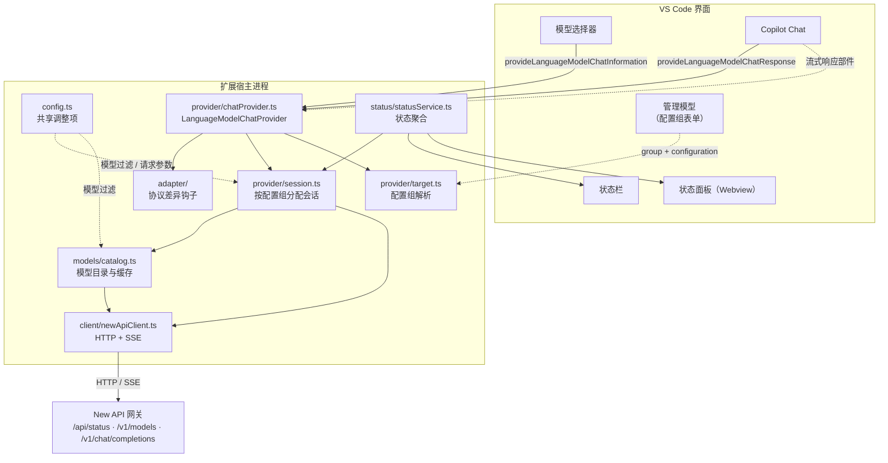
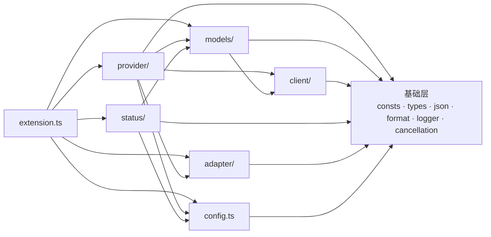

# 架构说明

面向要修改这个代码库的人。读完应该能回答三个问题：**代码在哪**、**为什么这么分层**、
**改动某类需求该动哪里**。

- 使用者视角的功能与配置说明见 [`README.md`](../README.md)。
- 与 VS Code / New API 打交道的协议细节见下文各模块的小节。

---

## 1. 这个扩展在做什么

把 [New API](https://github.com/QuantumNous/new-api)（OpenAI 兼容网关）里的模型，
作为**自带密钥（BYOK）**的语言模型供应商注册给 GitHub Copilot Chat。

实现的是 VS Code 的 `LanguageModelChatProvider` 接口（三个方法：发现模型、处理请求、估算 token），
难点不在接口本身，而在接口两侧的落差：

| 落差 | 具体表现 |
| --- | --- |
| **模型元数据缺失** | `/v1/models` 通常只返回 `id`；而 VS Code 需要上下文窗口、输出上限、图片/工具能力 |
| **消息模型不同** | VS Code 只有 User / Assistant 两种角色、工具结果挂在用户消息里；OpenAI 兼容协议有 `system` / `role: 'tool'` 独立消息 |
| **配置来自 VS Code** | 站点与密钥由 VS Code 的 provider 配置组下发，且同一供应商可以有多个组 |
| **上游实现不一致** | 思考字段名、`max_tokens` 与 `max_completion_tokens`、推理模型不接受 `temperature` 等 |

整个代码结构基本就是在分别处理这四个落差。

## 2. 总体数据流



一次对话请求的完整路径：

1. Copilot Chat 选中某个模型 → 调用 `provideLanguageModelChatResponse(model, messages, options, progress, token)`。
2. provider 用 `model.targetKey` 找回**模型所属配置组**对应的会话（多站点时这一步很关键）。
3. `provider/messages.ts` 把 VS Code 消息转成 `/v1/chat/completions` 的请求体。
4. `adapter` 的 `transformRequest` 钩子按模型改写请求（当前是恒等变换）。
5. `client` 发起流式请求，SSE 逐块解析。
6. `provider/stream.ts` 把 chunk 翻译成 `LanguageModelTextPart` / `LanguageModelToolCallPart` 并上报 `progress`。
7. 结束时把上游 `usage` 交给 `status` 统计。

## 3. 代码地图

| 文件 | 行数 | 职责 |
| --- | ---: | --- |
| `extension.ts` | 320 | 激活与装配。**只做接线**，读它能看清整体数据流 |
| **基础层** | | |
| `consts.ts` | 137 | 命令 ID、端点、默认值、运行时版本 |
| `types.ts` | 272 | New API / OpenAI 兼容（DeepSeek 风格）数据结构 |
| `json.ts` | 174 | 安全解析、类型收窄、按键取候选值 |
| `format.ts` | 94 | token / 时长 / 相对时间格式化、Markdown 转义 |
| `logger.ts` | 286 | `LogOutputChannel` + 级别闸门 + 密钥脱敏 |
| `cancellation.ts` | 67 | `CancellationToken` → `AbortSignal` 桥接 |
| **`client/`** 与 New API 交互 | | |
| `http.ts` | 423 | 超时、重试退避、信号合并、错误分类（`HttpError` / `TransportError`） |
| `sse.ts` | 251 | SSE 解析、静默超时、非 SSE 降级读取 |
| `newApiClient.ts` | 407 | 端点封装、模型列表解析、失败建议 |
| **`models/`** 模型信息整合 | | |
| `dataset.ts` | 219 | 本地模型数据表（`data/openrouter-models.json`）：校验、索引与查找 |
| `matcher.ts` | 51 | 极简 glob 匹配与 include/exclude 判定 |
| `modelConfig.ts` | 559 | 多来源合并、一致性校正、远端字段提取 |
| `tooltip.ts` | 149 | 悬浮窗 Markdown（含数据来源标注） |
| `catalog.ts` | 223 | 拉取编排、缓存、并发合并、失败降级 |
| **`provider/`** 与 Copilot 交互 | | |
| `target.ts` | 139 | 解析 VS Code 下发的配置组 + 配置指纹 |
| `session.ts` | 175 | 按配置组缓存 client + catalog |
| `chatProvider.ts` | 420 | 实现 `LanguageModelChatProvider` |
| `messages.ts` | 336 | VS Code ⇄ OpenAI 兼容的消息转换 |
| `stream.ts` | 276 | 流式 chunk → 响应部件（工具调用分片合并、思维链） |
| `tokenizer.ts` | 112 | token 估算（刻意高估） |
| **`adapter/`** 差异出口 | | |
| `adapter.ts` / `registry.ts` / `defaultAdapter.ts` | 203 | 钩子接口、注册与解析、恒等实现 |
| **`status/`** UI | | |
| `statusService.ts` | 340 | 状态的唯一真相来源，按配置组聚合 |
| `statusBar.ts` | 160 | 状态栏渲染 |
| `panel.ts` | 599 | Webview 面板（HTML + 手写 DOM 脚本） |
| **测试** | | |
| `test/*.test.ts` + `test/helpers.ts` | 770 | 71 个用例，只覆盖纯函数与装配 |

## 4. 分层与依赖方向



几条刻意维持的约束：

- **`client` 只在运行时依赖基础层**。它用 `AbortSignal` 而不是 `CancellationToken`，
  因此网络逻辑不绑死在 VS Code 上，便于单独推理与替换。
- **`models` 是纯数据转换**，不注册命令、不发请求（`catalog` 只调用注入的 client）。
  因此它能被单元测试直接覆盖。
- **`provider` 不直接构造 client**，一律通过 `SessionRegistry` 拿会话。这样多站点隔离
  与配置变更时的重建都只有一处实现。
- **`status` 只做聚合与渲染**，从不自己发请求（状态全部来自 `StatusService` 的订阅者）。
- **`extension.ts` 不含业务逻辑**。它是唯一知道「怎么把模块拼起来」的地方。

## 5. 基础层

### `consts.ts`

只放**不随用户配置变化**的字面量。任何用户可改的值必须先在 `package.json` 的
`contributes.configuration` 里声明，再由 `config.ts` 读取——不要把可配置项的默认值写死在这里。
站点与密钥属于另一类：它们在 `contributes.languageModelChatProviders[].configuration` 里声明，
只在 `provider/target.ts` 读取。

`VENDOR_ID` 需要与三处保持一致（`package.json` 贡献点、激活事件
`onLanguageModelChatProvider:<vendor>`、注册调用）；`runtimeInfo` 在 `activate()` 时
由 `package.json` 的版本号填充，避免硬编码版本漂移。
`MANAGE_MODELS_COMMAND` 是 VS Code 内置的「管理语言模型」界面，配置引导都指向它
（它由 `chatManagement.contribution.ts` 注册，界面里的齿轮入口用的也是同一个 ID）。

### `types.ts`

以 OpenAI Chat Completions 为基准，**服务端字段一律可选**：网关版本、上游模型、代理层
都可能裁掉字段，代码必须把「字段缺失」当常态。无法穷举的字段交给索引签名兜底。

### `json.ts`

把所有「解析不可信数据」的防御性代码收敛到一处，让上层能直白地写业务逻辑。
这里刻意**不抛异常**：`safeJsonParse` / `safeJsonStringify` 失败返回 `undefined`。
`pickString` / `pickNumber` / `pickBoolean` 按候选键名依次取值，用于兼容同一语义在不同
网关上的多种字段名。

### `logger.ts`

基于 `createOutputChannel(name, { log: true })`，用户在「输出」面板里能直接调整级别。
两个要点：

- 我们自己的级别闸门与通道级别是**两回事**。若配置的级别比通道级别更详细，日志会被通道
  吞掉——`warnIfChannelLevelBlocks()` 会检测这种情况并主动提示用户（这类「配了却看不到」
  的问题极难自查）。
- `redactText` 用一组正则兜底脱敏。**即使调用点忘了用 `redactSecret`，密钥也不会整串落进日志。**

### `cancellation.ts`

VS Code 用 `CancellationToken`，网络 API 用 `AbortSignal`。集中在这里做转换，
并在请求结束后 `dispose()` 解除监听，避免长期持有 token 引用。

## 6. `client/` —— 与 New API 交互

### 超时策略（`http.ts`）

| 请求类型 | 超时语义 |
| --- | --- |
| 非流式 | **整体超时**（连接 + 读取） |
| 流式 | `timeoutMs` 只作为「等响应头」的上限；响应体开始到达后交给 `sse.ts` 的**静默超时** |

这一点很重要：流式请求若套用整体超时，一个正常但很长的回答会被误杀。改用「两个数据块之间
的空闲时间」判定，正常长回答（持续吐字节）不受影响，而真正卡死的连接会及时断开。

`createSignalGuard` 把「调用方信号 + 超时 + 客户端释放」合并成一个 `AbortSignal`，
并记录是否由超时触发，以便生成准确错误。

### 重试

只对**可重试**的失败重试：网络错误、超时、`408` / `409` / `425` / `429` / `5xx`。
4xx 业务错误（如参数不合法）不重试——重试只会重复失败。退避是指数增长 + 抖动，
并尊重服务端的 `Retry-After`。**一旦开始消费响应体就不再重试**，因为服务端可能已开始计费。

### 错误分类

- `TransportError`：`network` / `timeout` / `aborted` 三种，用于区分「连不上」「超时」「用户取消」。
- `HttpError`：带 `status`、服务端错误描述、`Retry-After`，并提供 `isAuthError` /
  `isNotFound` / `isRetryable` 语义化判断。

`isAbortError` 单独处理：用户点「停止」导致的取消是正常流程，不该被当成失败上报。

### `sse.ts`

容错点：三种换行符都支持、`:` 开头的心跳注释行忽略、流结束时不带结尾换行的残留事件也会处理、
单个 chunk 解析失败只记日志并跳过（网关偶尔会插入非 JSON 的心跳行）。

### 非流式降级

如果网关忽略了 `stream: true` 并返回普通 JSON（部分中转配置会这样），`newApiClient` 会检测
`content-type` 并把非流式响应**包装成一个等价的 chunk**，让上层只需要处理一种形态。
不这样做的话，SSE 解析器会把整段 JSON 当成一行无效数据而什么都拿不到。

### 连通性由状态服务组织

`client` 只提供两件原子能力：`listModels()`（模型列表）与 `getStatus()`（站点信息，
失败不抛异常，因为 `/api/status` 是 New API 的自有扩展，第三方兼容网关通常没有它）。

把两者拼成「这个站点现在怎么样」的地方是 `StatusService.refreshSession()`：

- 模型列表走 `catalog`（与 provider 共享缓存，因此状态里的数量就是模型选择器里的数量）；
- 站点信息走 `getStatus`，用得来的时耗作为延迟；
- 失败时由 `describeFailureHint()` 给出**可操作建议**（地址写错 / 密钥被拒 / 被限流 / 需要代理），
  而不是只丢一个错误字符串。

只有一处发起探测，因此状态栏、面板与「测试连接」命令的口径天然一致。

## 7. `models/` —— 模型信息整合

这是最能体现「为什么要多加一层」的模块。

### 四个来源的优先级

```
① 用户在设置里按模型 ID 做的精确覆盖        （override）
② 网关返回的扩展字段                        （remote）
③ 随包的数据表按模型 ID 查表                 （dataset）
④ 兜底默认值                                  （default）
```

**越靠前的越可信**：用户最了解自己渠道的实际情况；网关返回的窗口通常比通用数据表更准确
（同一模型在不同中转上的窗口确实不同）。

`resolveModelConfig` 为每个字段记录来源到 `meta.provenance`，tooltip 与状态面板都会展示，
并在来源冲突时给出提示。用户看到数值不符时，能立刻知道该不该相信它、以及该去哪里改。

### 一致性校正

四个来源合起来很容易得到自相矛盾的数值（例如数据表说窗口 8K，网关却说输出上限 16K）。
`reconcileLimits` 统一收敛，保证：

- `maxInputTokens + maxOutputTokens <= contextWindow`；
- 输出上限不会挤占掉输入空间（至少给输入留 1/4 窗口）；
- 各项都不低于合理下限。

每一次修正都会写入 `meta.notes` 并显示在 tooltip 里——**静默修正数值比不修正更糟**。

### 远端字段提取

`extractRemoteHints` 覆盖实际观察到的几种风格：New API / one-api 的 `context_length`、
OpenRouter 的 `top_provider.max_completion_tokens` 与 `architecture.input_modalities`、
vLLM 的 `max_model_len`、通用的 `supports_vision` / `capabilities.*`。

一个刻意的保守决定：New API 的 `/v1/models` 会返回 `max_tokens`，但它的语义含糊
（可能是输出上限，也可能被上游当成上下文长度）。代码**不据此臆测上下文窗口**，
只当作输出上限——上下文窗口留给模型数据表或用户覆盖。

### 本地模型数据表（`dataset.ts` + `data/openrouter-models.json`）

数据表是一个随包发布的 JSON 文件（约 340 条记录，覆盖主流厂商与国产模型），由
`npm run models:openrouter` 从公开模型目录生成；`extension.ts` 在激活时读入，
`dataset.ts` 负责校验、建索引与查找。

几个关键取舍：

- **不做成源码里的常量表**：几百条数据且持续变动。独立文件让「更新数据」不必改代码，
  数据也不进 TypeScript 编译；校验逻辑只有一处，坏数据不会变成难以定位的类型错误。
- **数据是不可信输入**：缺 `id`、或缺正数 `contextWindow` / `maxOutputTokens` 的条目在载入时
  被丢弃并计数（日志会说明丢了多少条），单条坏数据不会让整张表失效。
- **匹配从精确到宽松**：表里的 `id` 是规范化过的，而网关的 ID 常带渠道与日期后缀
  （`gpt-4o@official`、`gpt-4o-2024-08-06`）。查找先精确命中，命中不了才逐层剥掉厂商前缀、
  变体后缀、渠道后缀与日期后缀。「先精确」的次序保证 `gpt-4o-2024-08-06` 不会挑中 `gpt-4o`。
- **数据表只是优先级中的一环**：它是生成时的快照，厂商会调整、渠道有差异，
  因此用户随时可以用 `models.overrides` 覆盖。

### 缓存与失败降级（`catalog.ts`）

- **并发合并**：VS Code 可能在短时间内多次调用模型发现，用 in-flight promise 合并成一次请求。
- **stale-while-error**：曾经成功过就用旧数据 + 错误标记。用户已经看到的模型不该因为网关抖动而消失。
- **失败不缓存空结果**：从未成功过时**不写 snapshot**，改用 10 秒退避。否则一次瞬时失败会把
  「没有模型」缓存住整个 TTL，用户看到模型选择器空空如也却找不到原因。
- **不接入调用方的 CancellationToken**：模型列表是共享且带缓存的资源，见下节。

> ⚠️ **踩过的坑**：VS Code 会在 UI 更新后立即取消 `provideLanguageModelChatInformation` 的 token
> （例如模型选择器收起）。最初把该信号接到了共享的模型列表请求上，结果一次取消会连带取消
> 其他调用方的请求。现在 provider 层刻意不传该参数，交给 catalog 自己的超时与并发合并管理。

## 8. `provider/` —— 与 Copilot 交互

### 配置组解析（`target.ts`）

配置完全由 VS Code 提供。`package.json` 的 `configuration` 贡献点是一份 JSON Schema，
VS Code 据此在「管理模型」界面生成表单，并把解析好的值随调用传进来：

```ts
provideLanguageModelChatInformation({ group, silent, configuration }, token)
```

`createTarget` 把它归一成 `ProviderTarget`（规范化的 `baseUrl` + 明文 `apiKey` + 配置指纹 + 问题列表），
之后的 client / catalog 只认这一种输入。

标记为 `secret: true` 的 `apiKey` 由 VS Code 存入系统钥匙串，传入时已解析回明文；
同一供应商可以有多个配置组（多个站点），组名用于区分。

**`key` 是配置指纹（FNV-1a），绝不包含明文密钥**——它会作为 Map 键并出现在日志里。
`baseUrl` 在这里被 `normalizeBaseUrl` 归一（该函数幂等，因此不依赖调用方预处理）。

stable 的 `PrepareLanguageModelChatModelOptions` 类型目前只声明了 `silent`，
因此 `readOptionsGroup` / `readOptionsConfiguration` 做运行时探测；拿不到就返回
「本次调用未携带配置」，provider 相应地不提供模型。

### 会话隔离（`session.ts`）

按目标维护一份 `{ client, catalog }`：

- **不能全局共用**：否则 A 站的模型列表会串到 B 站。
- **不该每次新建**：VS Code 会反复轮询，每次新建 client 会不断建立新连接。
- **槽位是组名**：同一槽位只保留一个会话，配置指纹变了就重建旧的（旧 client 的 `dispose()`
  会中断在途请求，避免拿到按过期配置发出的响应），因此 Map 不会堆积。
- **`find(key)`**：响应阶段靠模型上带的指纹找回会话。**找不到时不能退回默认目标**——
  那会把 A 站的模型拿去 B 站请求。

模型信息里只挂**指纹与标签**，不挂目标本体：这些字段会随模型元数据长期留在 VS Code 的
模型缓存里，而 `ProviderTarget` 含有明文 API Key。

### 模型发现（`chatProvider.ts`）

`options.silent === true` 时**绝不弹任何 UI**——那是 VS Code 在问「现在有没有可用模型」，
每次打开模型选择器都会调用一次，弹窗会变成骚扰。

模型列表加载失败时**不向外抛异常**，而是返回空数组：表现为「没有模型」，
由状态栏与面板负责告诉用户原因。

`toModelInformation` 通过泛型 `LanguageModelChatProvider<T>` 把内部 `ModelConfig`
一并交给 VS Code——它会把这个对象原样传回响应方法，因此响应阶段能拿到已解析的能力与窗口。

### 消息转换（`messages.ts`）

| 概念 | VS Code | OpenAI 兼容 |
| --- | --- | --- |
| 角色 | 只有 `User` / `Assistant` | `system` / `user` / `assistant` / `tool` |
| 工具调用 | 助手消息里的 `LanguageModelToolCallPart` | 助手消息的 `tool_calls` |
| 工具结果 | 用户消息里的 `LanguageModelToolResultPart` | **独立**的 `role: 'tool'` 消息，带 `tool_call_id` |
| 图片 | `LanguageModelDataPart`（mimeType + Uint8Array） | `image_url`，URL 为 `data:` 形式 |

因此一个 VS Code 消息可能被拆成**多条**上游消息，且顺序敏感：`assistant(tool_calls)`
之后必须紧跟若干条 `tool` 消息，顺序错了上游会直接报 400。

其他细节：带 `tool_calls` 时 `content` 必须为 `null`；`system` 角色由
「用户消息 + `name === 'system'`」启发式识别（VS Code 的消息模型没有 system 角色）；
未知部件尽力转成文本而不是丢掉（丢掉会让模型失去上下文）。

### 流式翻译（`stream.ts`）

需要处理的琐事：

1. **工具调用分片到达**：`function.arguments` 会被切开，必须按 `index` 归并、按到达顺序拼接，
   最后才能 parse。**统一在流结束时上报工具调用**——只有那时才能确定参数拼完整了。
2. **思维链有两种字段名**：DeepSeek 用 `reasoning_content`，OpenRouter 等用 `reasoning`。
3. **usage 只在最后一个 chunk**：单独记下用于统计。
4. **多 choice**：VS Code 的响应模型是单条回答，只取 `index === 0`（并对 `n > 1` 给出警告）。

工具参数解析失败时返回空对象而不是抛异常：让 VS Code 报出参数校验失败（模型可自我修正），
比直接丢掉这次工具调用更好。上游偶尔把 JSON 包在 Markdown 代码块里，会被自动剥离。

### Token 估算（`tokenizer.ts`）

拿不到目标模型的真实分词器（各家不同，网关也不暴露），因此只能估算：
CJK 按 1 字符 ≈ 1 token，其余按 4 字符 ≈ 1 token，再加消息/工具/图片的固定开销。

**偏差方向是有意选择的**：宁可高估。高估会让 VS Code 更早裁剪历史，代价是少一点上下文；
低估则会把超长请求发给上游，直接被拒绝——后者对用户来说是完全失败。

## 9. `adapter/` —— 协议差异的出口

不同上游对 OpenAI 协议的实现并不一致：

- 推理模型不接受 `temperature`，且只认 `max_completion_tokens`；
- 思考开关的字段名各异（`enable_thinking` / `thinking` / `reasoning_effort`）；
- 有的网关不支持 `tool_choice: required`，必须降级成 `auto`。

这些差异若全写进 provider，会散落大量 `if (model.id.startsWith(...))`。
`ModelAdapter` 就是它们的唯一出口，三个可选钩子：

| 钩子 | 时机 | 典型用途 |
| --- | --- | --- |
| `transformRequest` | 请求发出前 | 删除不支持的参数、补充网关专属字段 |
| `transformChunk` | 每个流式 chunk | 统一字段名、合并分片 |
| `finalize` | 流结束 | 冲刷适配器内部缓冲 |

**当前只注册了恒等变换的 `DefaultModelAdapter`（占位实现），三个钩子刻意都不实现**——
钩子未定义时 provider 直接透传，效果就是恒等变换；保留空实现反而多出无意义的调用与拷贝。

`AdapterRequestState` 把跨 chunk 的累积状态显式传入，而不是让适配器持有实例字段，
这样同一个适配器实例可以被多个并发请求安全复用。

## 10. `status/` —— 状态栏与面板

### 分工

- **状态栏**只有一格，只回答「能不能用」。文本极短（`$(cloud) 12 模型`），
  细节放进 Markdown tooltip；只在需要用户行动时着色，避免把状态栏变成常亮的警告灯。
- **面板**回答「为什么」：各配置组的状态、模型清单（含每个数值的来源）、
  被过滤的模型、会话用量、适配器链、日志入口。

### 多配置组的正确呈现

配置组可以有多个，因此状态是**按目标聚合**的：`targets` 数组每个元素对应一个组，
整体可用性取「是否存在任一可用目标」（`anyUsable`），状态栏的模型数是各组之和。

这样有两个好处：

- 某个组临时挂掉不会让整块状态栏变红，只是那一行标为不可用；
- 配置不完整（缺地址/缺密钥）时能精确定位到是哪个组，而不是笼统地说「未配置」。

### 渲染方式

面板只在打开时存在，但状态变化可能频繁。因此：

- HTML 骨架只生成一次，状态通过 `postMessage` 增量下发，避免重建 DOM 导致滚动位置丢失；
- 模型清单可能上百条，不放进每次下发的 state，而是随状态一起按需下发；
- **Webview 脚本全部用 DOM API 构造节点**（`textContent`），不拼 innerHTML——
  模型 ID、站点名都来自外部，拼字符串必然要处理转义，而转义写错就是注入漏洞。
  用 `h()` 辅助函数从根上避免这个问题；
- CSP 为 `default-src 'none'`，样式与脚本用 nonce 放行。

## 11. 常见改动该动哪里

### 补一个模型的元数据

改数据表而不是改代码：跑 `npm run models:openrouter` 重新生成 `data/openrouter-models.json`。
若上游目录里没有这个模型，或某个渠道的数值确实不同，让用户用 `models.overrides` 覆盖，
而不是把渠道差异写进数据表。

### 让某个模型的行为不一样（新增适配器）

1. 实现 `ModelAdapter`，`supports()` 判断是否命中该模型；
2. 在 `adapter/registry.ts` 的 `createDefaultAdapterRegistry()` 里注册（`priority` 高者先匹配）；
3. 加测试。

**不需要改 provider**——这是这一层存在的意义。

### 新增设置项

1. `package.json` → `contributes.configuration.properties`（含类型、默认值、说明）；
2. `src/config.ts` → 在 `readSettings()` 里读取并收敛（非法值要记录并回退，不要让整份配置失效）；
3. 在对应的 Settings 接口里加字段；
4. 若影响模型配置，改 `models/modelConfig.ts`；若影响请求，改 `provider/chatProvider.ts`
   的 `buildRequest`。

### 新增配置组字段（用户要填的站点/密钥类字段）

这类字段**不是**设置项，而在 `contributes.languageModelChatProviders[].configuration` 里声明：

1. `package.json` → provider 的 `configuration.properties` 加字段（密钥类记得 `secret: true`）；
2. `src/provider/target.ts` → 在 `createTarget()` 里读取并校验，写入 `ProviderTarget`
   与 `issues`（校验失败要能告诉用户到底缺什么）；
3. 若该字段影响连接身份，把它纳入 `key` 指纹，否则配置改了会复用旧会话；
4. `src/provider/session.ts` → 需要的话传给 `NewApiClient`。

### 新增命令

1. `consts.ts` 的 `COMMANDS` 加键；
2. `package.json` 的 `contributes.commands` 加条目；
3. `extension.ts` 里 `registerCommand`。

### 新增一个探测/展示字段

`client/newApiClient.ts` 的 `getStatus` / `ModelCatalogSnapshot` → `status/statusService.ts`
的 `TargetStatus` → `status/statusBar.ts` 与 `status/panel.ts` 渲染。
注意面板脚本是**字符串里的 JS**，不受 TypeScript 检查。

## 12. 已知取舍

| 取舍 | 原因 | 将来的出口 |
| --- | --- | --- |
| 思考内容只能作为正文回显，包成 Markdown 引用块 | 稳定的 VS Code API 没有「思考内容」响应部件 | 有专用部件后只需改 `stream.ts` 的 `emitReasoning` |
| token 用字符数启发式估算 | 拿不到真实分词器 | 若上游能给出精确计数接口，替换 `tokenizer.ts` |
| 随包的数据表会过期 | 厂商会调整窗口与能力 | 重跑 `npm run models:openrouter`；`models.overrides` 覆盖；数据表只是优先级的一环 |
| 面板脚本是手写 DOM，不用框架 | 状态量小，引入构建步骤不值得 | 面板复杂度明显上升时再考虑 |
| 会话用量统计是全局累加的 | 单一计数器足够回答「这次会话花了多少」 | 需要分组统计时按 `targetLabel` 分桶 |
| 状态刷新会同时打 `/v1/models` 与 `/api/status` | 前者与 provider 共享缓存（数量一致），后者提供站点名与延迟；两个请求开销都很小 | 若站点众多，改为只刷新当前可见的组 |
| 适配器层是占位实现 | 先建立接口与装配点 | 见 §11「新增适配器」 |
| 网关忽略 `stream: true` 时没有逐字输出 | 只能按单块响应处理 | 无解，取决于网关 |

## 13. 测试

`npm test` 在真实 VS Code 测试宿主中运行（`@vscode/test-cli` + `@vscode/test-electron`），
71 个用例，只覆盖**纯函数与装配**：

| 文件 | 覆盖 |
| --- | --- |
| `test/models.test.ts` | glob 匹配、family 推导、远端字段提取、配置整合与一致性校正、批量过滤 |
| `test/provider.test.ts` | token 估算、消息转换（工具/图片/system）、工具转换与参数解析 |
| `test/target.test.ts` | 配置组解析、地址规范化、指纹（含「不含明文密钥」断言）、会话隔离与重建 |
| `test/extension.test.ts` | 扩展能激活、命令都注册上、缺配置时不崩 |

刻意不测的部分：真实网络交互（需要可用的 New API 站点）、Webview 渲染（需要人工验收）、
VS Code 与 provider 之间的协议往返（由 VS Code 自己保证）。

写新测试时的注意点：

- 需要日志时用 `test/helpers.ts` 的 `testLogger()`（复用同一个关闭输出的通道）；
- `SessionRegistry` 的用例记得 `dispose()`，否则会遗留事件订阅；
- 涉及密钥的断言应当验证**指纹与序列化结果里不含明文**，这类回归最难在评审时看出来。
