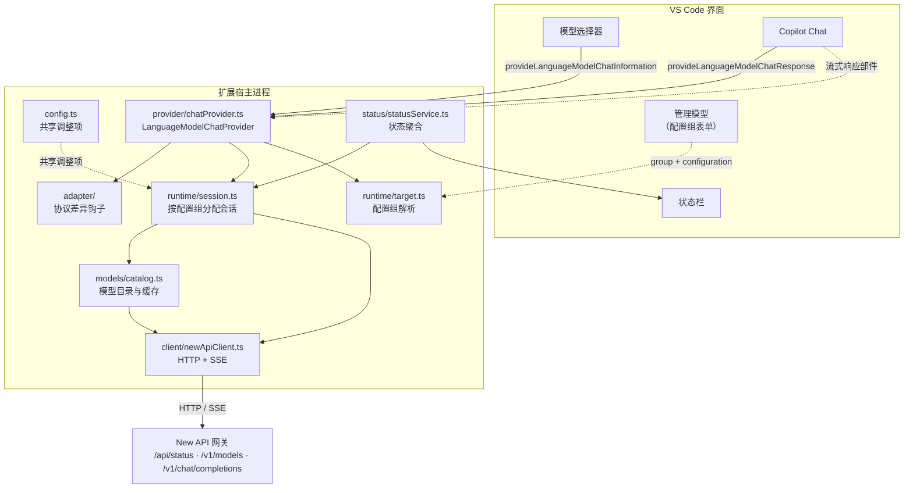
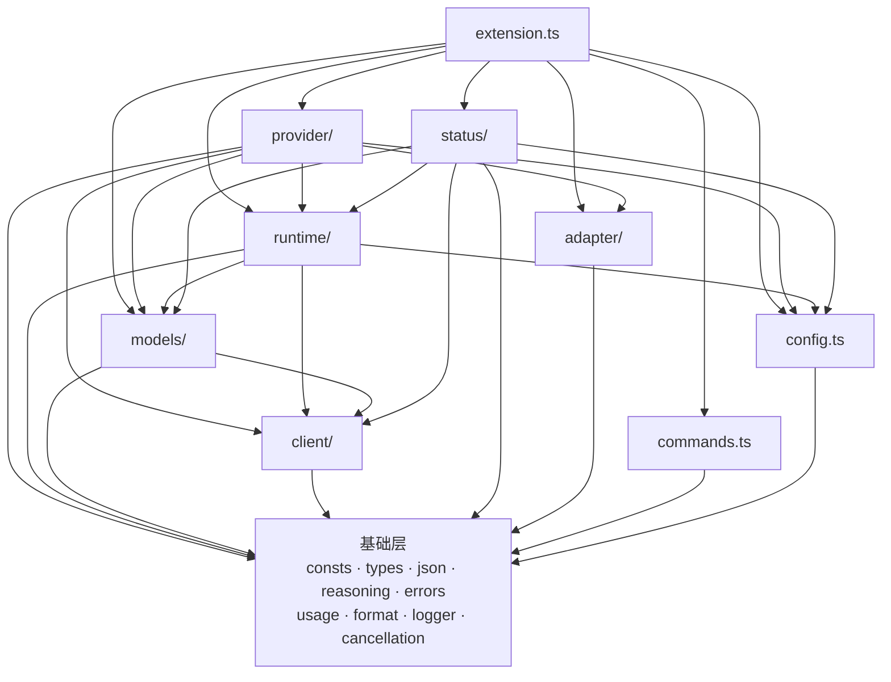

# 架构说明

面向要修改这个代码库的人：**代码在哪**、**为什么这么分层**、**改动某类需求要动哪里**。
使用者的功能与配置说明见 [`README.zh-CN.md`](../README.zh-CN.md)（英文版见 [`README.md`](../README.md)）。

## 1. 这个扩展在做什么

把 [New API](https://github.com/QuantumNous/new-api)（OpenAI 兼容网关）里的模型，作为
**自带密钥（BYOK）**的语言模型供应商注册给 GitHub Copilot Chat，实现 VS Code 的
`LanguageModelChatProvider`（发现模型、处理请求、估算 token）。难点不在接口本身，而在接口两侧的落差：

| 落差 | 具体表现 |
| --- | --- |
| **模型元数据缺失** | `/v1/models` 通常只返回 `id`，而 VS Code 需要上下文窗口、输出上限、图片/工具能力 |
| **消息模型不同** | VS Code 只有 User / Assistant 两种角色、工具结果挂在用户消息里；OpenAI 兼容协议有 `system` 与独立的 `role: 'tool'` |
| **配置来自 VS Code** | 站点与密钥由 VS Code 的 provider 配置组下发，同一供应商可以有多个组 |
| **上游实现不一致** | 思考字段名、`max_tokens` 与 `max_completion_tokens`、推理模型不接受 `temperature` 等 |

代码结构就是分别处理这四个落差。

## 2. 数据流


```mermaid
flowchart TD
    subgraph ui["VS Code 界面"]
        picker["模型选择器"]
        chat["Copilot Chat"]
        manage["管理模型<br/>（配置组表单）"]
        bar["状态栏"]
    end

    subgraph host["扩展宿主进程"]
        cfg["config.ts<br/>共享调整项"]
        target["runtime/target.ts<br/>配置组解析"]
        provider["provider/chatProvider.ts<br/>LanguageModelChatProvider"]
        sessions["runtime/session.ts<br/>按配置组分配会话"]
        catalog["models/catalog.ts<br/>模型目录与缓存"]
        client["client/newApiClient.ts<br/>HTTP + SSE"]
        adapter["adapter/<br/>协议差异钩子"]
        status["status/statusService.ts<br/>状态聚合"]
    end

    gateway["New API 网关<br/>/api/status · /v1/models · /v1/chat/completions"]

    picker -->|"provideLanguageModelChatInformation"| provider
    chat -->|"provideLanguageModelChatResponse"| provider
    chat -.->|"流式响应部件"| provider
    manage -.->|"group + configuration"| target
    provider --> adapter
    provider --> sessions
    sessions --> catalog
    sessions --> client
    provider --> target
    catalog --> client
    client -->|"HTTP / SSE"| gateway
    status --> sessions
    status --> bar
    cfg -.->|"共享调整项"| sessions
```

几件容易看漏的事：

- **消息会一变多**：一条 VS Code 消息可能拆成 `assistant(tool_calls)` + 若干 `tool` 消息，顺序错了上游直接 400（见 §8 消息转换）。
- **正文是边收边发的**：`progress.report()` 在收流的循环里调用，用户看到的逐字输出不是等流结束才出现。
- **请求被强制带上 `stream: true` 与 `stream_options.include_usage`**：用量只在最后一个 chunk 里回来（见 §8 回传用量）。
- **工具调用在收尾时才上报**：参数是分片到达的，中途无法解析，因此统一在 `StreamTranslator.flush()` 里上报（上游给出 `finish_reason` 时提前上报）——这就是工具部件在时序上晚于所有正文片段的原因。
- **流被掐断时看「用户是否已看到内容」**：没看到且还有额度就重发整次请求（最多 2 次），否则保留已收到的内容只记警告。判定抽成纯函数 `decideStreamFailure`；「已上报部件数」只算真正 `progress.report` 出去的东西，不回显的思维链与未 flush 的工具调用都不算，因此重发不会造成重复。

关键判定点（细节见各层小节）：

| 判定 | 落点 | 行为 |
| --- | --- | --- |
| 找不到模型所属的会话 | `chatProvider.ts` | 抛错提示重新选择模型（配置组已变更） |
| 一条 VS Code 消息里的部件**全部**被跳过 | `chatProvider.ts` | 抛错，不发请求 |
| 模型是 DeepSeek 且具备思考能力 | `adapter/deepseek/` | 写入 `thinking: { type: 'enabled' }` |
| 辅助请求（起标题、提交信息…） | `adapter/deepseek/` | `thinking: { type: 'disabled' }` 并去掉 `reasoning_effort` |
| HTTP 非 2xx | `client/http.ts` | `HttpError`，按 `isAuthError` / `isNotFound` / `isRetryable` 分流 |
| 可重试的错误 | `client/http.ts` | `Retry-After` 优先，否则指数退避 + 抖动 |
| `Retry-After` 超过 30 秒 | `client/http.ts` | 不重试，把带等待时间的 429 直接报出来 |
| `content-type` 不是 SSE | `client/newApiClient.ts` | 降级为单块 JSON，而不是静默失败 |
| 静默超时（长时间没有新字节） | `client/sse.ts` | `SseIdleTimeoutError`，与用户取消区分 |
| 流量正常结束但缺 `[DONE]` 与 `finish_reason` | `client/newApiClient.ts` | `SseTruncatedError`（半截回答不能当成功） |
| 流被掐断、还没上报过任何部件 | `provider/streamFlow.ts` | 重发整次请求（最多 2 次），逐次重建 translator |
| 流被掐断、但已上报过内容 | `provider/streamFlow.ts` | 保留已收到的内容，只记警告；参数不完整的工具调用在 flush 时丢弃 |
| 站点以 400 拒绝并点名了一个可选字段 | `provider/requestRepair.ts` | 去掉那个字段重发（最多 2 轮），已试过的步骤不重复 |
| 站点以 400 拒绝但没说清字段 | `provider/requestRepair.ts` | 不修，把上游原话交给用户 |
| 自愈改过请求仍被 400 拒绝 | `provider/streamFlow.ts` | 记下「去掉过什么」后照常失败 |
| 响应正常结束且带用量 | `provider/chatProvider.ts` | 回传 `usage` 数据部件（见 §8 回传用量） |
| chunk 带 `error` 字段 | `provider/stream.ts` | 视为失败抛出（上游会把错误塞进 200 响应） |
| 工具调用缺少函数名 | `provider/stream.ts` | 记警告并跳过 |
| 工具分片不带 `index` | `provider/stream.ts` | 按有无 `id` 判断新调用，续传分片接在同一个槽位 |
| 工具参数不是合法 JSON | `provider/stream.ts` | 先直解，再剥 Markdown 围栏；正常结束则退化为 `{}`，流被掐断则丢弃这次调用 |
| `finish_reason === 'length'` | `provider/stream.ts` | 记警告（响应被截断） |
| 取消（`isAbortError` 或 token 已取消） | `chatProvider.ts` | 静默返回，**不算失败** |
| 其它错误 | `chatProvider.ts` | `toLanguageModelError` 把面向用户的消息交给 VS Code（见 §8） |

## 3. 代码地图

| 文件 | 职责 |
| --- | --- |
| `extension.ts` | 激活与装配。**只做接线**，读它能看清整体数据流 |
| `commands.ts` | 命令实现（测试连接 / 刷新模型 / 打开设置 / 重置用量）与「刷新后通知宿主」 |
| **基础层（各层都可依赖）** | |
| `consts.ts` | 命令 ID、端点、默认值、思考强度键名、用量部件 MIME、运行时版本 |
| `config.ts` | 共享调整项（缓存与兜底值、请求参数、状态栏、日志级别）的读取与校验 |
| `types.ts` | New API / OpenAI 兼容（DeepSeek 风格）数据结构 |
| `json.ts` | 安全解析、类型收窄、按键取候选值 |
| `reasoning.ts` | 思维链字段的读取与回填键名：**通用层唯一**知道各家字段名的地方 |
| `errors.ts` | 网络错误码 → 分类 → 人话，以及日志用的错误链渲染 |
| `usage.ts` | 用量的读出（缓存命中、思维链 token、各网关字段名）与回传 Copilot 的载荷 |
| `format.ts` | token / 相对时间格式化、Markdown 转义：**展示文案的唯一出口** |
| `logger.ts` | `LogOutputChannel` + 级别闸门 + 密钥脱敏 + 带上 `cause` 链的错误格式化 |
| `cancellation.ts` | `CancellationToken` → `AbortSignal` 桥接 |
| **`client/`** 与 New API 交互（只依赖基础层） | |
| `http.ts` | 超时、重试退避、信号合并、错误分类（`HttpError` / `TransportError`） |
| `sse.ts` | SSE 解析与收尾信息、静默超时、非 SSE 降级读取、截断判定 |
| `newApiClient.ts` | 端点封装、模型列表解析、错误描述与失败建议 |
| **`models/`** 模型信息整合（只依赖基础层） | |
| `dataset.ts` | 模型数据表（`data/openrouter-models.json`）：校验、索引与查找 |
| `remoteHints.ts` | 远端字段提取：**唯一**知道各家网关字段名的地方 |
| `limits.ts` | 窗口/输出/输入的一致性校正、显著差异判定 |
| `modelConfig.ts` | 按优先级合并三路来源，记录来源与校正说明 |
| `tooltip.ts` | 悬浮窗 Markdown（身份行 + 规模与能力逐项一行、键值分列） |
| `catalog.ts` | 拉取编排、缓存、并发合并、失败降级 |
| **`runtime/`** 连接目标与会话 | |
| `target.ts` | 解析 VS Code 下发的配置组 + 配置指纹 |
| `session.ts` | 按配置组缓存 client + catalog |
| **`provider/`** 与 Copilot 交互 | |
| `chatProvider.ts` | 实现 `LanguageModelChatProvider`：编排与生命周期，外加三件只服务本文件的辅助（模型信息映射、请求体组装、错误交还） |
| `modelConfiguration.ts` | 模型级配置（思考强度）：schema 生成、取值解析、写进请求体 |
| `messages.ts` | VS Code ⇄ OpenAI 兼容的消息转换（含思考内容回填） |
| `stream.ts` | 流式 chunk → **中立**响应部件的翻译；不依赖 `vscode` |
| `streamFlow.ts` | 流的消费、重发门与 400 自愈循环；`ChatStreamSource` 是**传输维度的锚点**；中立部件 → 宿主部件 |
| `requestRepair.ts` | HTTP 400 的自愈阶梯，纯函数 |
| `tokenizer.ts` | token 估算（刻意高估，按真实用量校准比例） |
| `thinking.ts` | 思考内容部件的探测、构造与读取（宿主提供时才存在） |
| `replay.ts` | 思考内容的回放标记：随响应留下、下次请求读回 |
| `toolFlow.ts` | 工具组预激活（`activate_*`）与预激活控制流的过滤 |
| `preflight.ts` | 工具组预激活的宿主侧；独立于 `toolFlow.ts` 是为了让后者不依赖 `vscode` |
| **`adapter/`** 差异出口 | |
| `adapter.ts` / `registry.ts` / `defaultAdapter.ts` | 框架层：钩子接口与上下文、注册与解析、兜底与模板 |
| `deepseek/` | DeepSeek：请求种类识别、思考开关与辅助请求改写 |
| **`status/`** UI | |
| `statusService.ts` | 状态的唯一真相来源，按配置组聚合 |
| `statusBar.ts` | 状态栏渲染（悬浮提示 = 本次会话消耗 + 待处理的问题） |

## 4. 分层与依赖方向


```mermaid
flowchart TD
    ext["extension.ts"]
    cmd["commands.ts"]
    provider["provider/"]
    status["status/"]
    adapter["adapter/"]
    runtime["runtime/"]
    models["models/"]
    client["client/"]
    config["config.ts"]
    base["基础层<br/>consts · types · json · reasoning · errors<br/>usage · format · logger · cancellation"]

    ext --> cmd
    ext --> provider
    ext --> status
    ext --> adapter
    ext --> runtime
    ext --> models
    ext --> config
    provider --> runtime
    provider --> models
    provider --> client
    provider --> adapter
    provider --> config
    runtime --> models
    runtime --> client
    runtime --> config
    models --> client
    status --> runtime
    status --> models
    status --> client
    status --> config
    provider --> base
    runtime --> base
    models --> base
    client --> base
    status --> base
    adapter --> base
    cmd --> base
    config --> base
```

图中的箭头是**运行时依赖**，也是分层检查的判定依据。约束如下：

- **`client` 只在运行时依赖基础层**：用 `AbortSignal` 而不是 `CancellationToken`，网络逻辑不绑死在 VS Code 上。
- **`models` 只处理模型元数据**：不注册命令、不自己发请求；全层是纯数据转换 + 薄薄的拉取编排。
- **`adapter` 不依赖 `config`**：适配器只看模型配置与日志，拿不到用户设置，因此不会产生「设置不同、行为不同」的难复现分支。
- **`runtime` 只管「目标是谁、它有哪些运行时对象」**：既不知道 Copilot 的协议，也不渲染界面，因此 `provider` 与 `status` 可以同时依赖它。
- **`provider` 不直接构造 client**：一律通过 `SessionRegistry` 拿会话，多站点隔离与配置变更时的重建只有一处实现。
- **`status` 不自己构造请求**：只调用会话上已有的能力（`catalog.getModels` 与 `client.getStatus`），因此状态栏与「测试连接」命令看到的数据与 provider 出自同一份缓存。它对 `provider` **没有依赖**：需要的那点会话信息写成了结构接口（`StatusSessionSource`），会话注册表天然满足。
- **`status` 对 `models` 只有类型级依赖**（读的是 `ModelCatalogSnapshot` 的形状），拉取与整合仍归 `models`。
- **`usage.ts` / `reasoning.ts` 放在基础层**：被两侧共用，放在任一侧都会造成反向依赖。
- **`extension.ts` 不含业务逻辑**：它是唯一知道「怎么把模块拼起来」的地方，新增模块只在它里面接线。
- **这些约束有可执行的检查**：`npm run check-layering`（`scripts/check-layering.js`）维护一份「允许依赖宿主」的名单，名单外的文件一旦出现**运行时** `import 'vscode'` 就失败（`import type` 不算），因此「`client` 不碰 vscode」「翻译层不碰 vscode」这类说法不会因为一次顺手 import 而静默失效。
- **测试沿用同样的分层**：`src/test/` 用 Node 内置 `node:test` + esbuild 现场打包加载，因此纯逻辑层可以直接测；少数依赖宿主的模块由 `src/test/fakes.js` 的 `vscode` 替身顶上，**测试不需要扩展宿主**。

## 5. 基础层

- **`consts.ts`**：只放**不随用户配置变化**的字面量。用户可改的值先在 `package.json` 的 `contributes.configuration` 声明、再由 `config.ts` 读取；站点与密钥声明在 `contributes.languageModelChatProviders[].configuration` 里，只在 `runtime/target.ts` 读取。`VENDOR_ID` 要与三处保持一致（贡献点、激活事件 `onLanguageModelChatProvider:<vendor>`、注册调用），`runtimeInfo` 在 `activate()` 时由 `package.json` 的版本填充以避免版本漂移，`MANAGE_MODELS_COMMAND` 是 VS Code 内置的「管理语言模型」界面（配置引导都指向它）。
- **`config.ts`**：把 settings 收敛成内部结构，非法取值记录并回退到默认值——**不抛异常**，扩展不该因为一个设置项写错就不可用。
- **`types.ts`**：以 OpenAI Chat Completions 为基准，服务端字段一律可选（网关、上游、代理层都可能裁字段），无法穷举的交给索引签名。
- **`json.ts`**：把「解析不可信数据」收敛到一处，刻意**不抛异常**；`pick*` 系列按候选键名取值，兼容同一语义的多种字段名。
- **`reasoning.ts`**：思维链字段名的**唯一**来源（读 `reasoning_content` / `reasoning`，写回填键名），因此「上游换字段名」只改这一张表。这是**通用容错**而非供应商差异，所以不放进适配器。
- **`logger.ts`**：基于 `LogOutputChannel`。自己的级别闸门与通道级别是两回事，配得比通道更详细时 `warnIfChannelLevelBlocks()` 会提示；`redactText` 用正则兜底脱敏，**即使某个调用点忘了脱敏，密钥也不会整串落进日志**。
- **`errors.ts`**：网络错误码 → 分类 → 人话，同时提供日志用的错误链渲染；放基础层是因为日志与 `client/` 都要用。
- **`cancellation.ts`**：`CancellationToken` → `AbortSignal` 的集中转换，请求结束 `dispose()` 解除监听。

## 6. `client/` —— 与 New API 交互

**超时**：非流式是**整体超时**；流式的 `timeoutMs` 只作为「等响应头」的上限，响应体开始到达后交给 `request.streamIdleTimeoutMs` 的**静默超时**。两个旋钮分开是因为合理取值差得很远：长思考的模型可能长时间不吐字节，而把「等响应头」一起放宽会掩盖真正连不上的情况。**超时与重试只在客户端级配置**（`HttpClientOptions`），单次请求不能覆盖——否则「这个请求为什么重试了三次」将无从推理，而实际用到的差别都在客户端这一层。`createSignalGuard` 把「调用方信号 + 超时 + 客户端释放」合并成一个 `AbortSignal` 并记录是否由超时触发，其中断理由会原样成为 `fetch` 抛出的错误，因此超时文案就在那里定下。

**重试**：只重试网络错误、超时与 `408` / `409` / `425` / `429` / `5xx`；退避指数增长 + 抖动，并尊重 `Retry-After`。**一旦开始消费响应体就不再重试**（服务端可能已开始计费）。`Retry-After` 超过 30 秒不再重试：等到一半再撞一次 429 只会白拖时间，而且最终报错看不出真正原因。

**取消**：`vscode.CancellationError` 的 `name` 是 `Canceled` 而不是 `AbortError`，`isAbortError` 两个都认——否则用户点「停止」会被当成网络故障重试几次。

**错误分类**：`TransportError` 分 `network` / `timeout` / `aborted`；`HttpError` 带 `status`、服务端描述与 `Retry-After`，并提供 `isAuthError` / `isNotFound` / `isRetryable`。

**不变量：消息自己带建议。** 连接失败时 `fetch` 的外壳永远只是一句 `TypeError: fetch failed`，原因在 `cause` 里、诊断字段在它的平级属性上（`code` / `syscall` / …）。因此 `errors.ts` 按错误码分类配一句人话，两个出口各给各的读者：

| 出口 | 形态 | 给谁 |
| --- | --- | --- |
| `getNetworkErrorMessage` | `[ENOTFOUND]（api.example.com） 域名解析失败：请确认…` | 用户 |
| `describeErrorCause` | `fetch failed ← getaddrinfo ENOTFOUND … code=ENOTFOUND` | 日志 |

**码留在方括号里**：它是唯一能拿去搜索比对的原始信息，认不出的码照原样展示；普通构造名（`Error` / `TypeError`）不算码，但 `TimeoutError` / `SocketError` 这类 undici 名字有意义，照用。原始明细（`syscall` / `errno`）只进日志，主机只取 host——多站点配置下「哪个站点连不上」是第一个要回答的问题，路径与查询串没有价值。正因如此，`describeFailureHint` 对 `kind === 'network'` 返回 `undefined`：建议已经在消息里了，重复一遍只会让界面更吵。

**流怎么结束**：客户端要求流必须给出 `[DONE]` 或某个 chunk 的 `finish_reason`。两者都没有但已解出过数据块时报 `SseTruncatedError`，而不是把半截回答当成功；一个数据块都没解出来时不判定为截断（分不清「响应为空」与「格式不认识」）。

**`sse.ts` 的容错点**：按 `\n` 分帧并容忍 `\r\n`、忽略 `:` 开头的心跳注释行、处理流结束时不带结尾换行的残留事件、单个 chunk 解析失败只记日志并跳过。非 SSE 降级路径复用**同一套**静默超时。

**非流式降级**：网关忽略 `stream: true` 而返回普通 JSON 时，`newApiClient` 检测 `content-type` 并把响应**包装成一个等价的 chunk**，让上层只处理一种形态。

**连通性由状态服务组织**：`client` 只有两个原子能力（`listModels()` / `getStatus()`，后者失败不抛异常，因为 `/api/status` 是 New API 的自有扩展）。`StatusService` 把它们拼成「这个站点现在怎么样」，失败时由 `describeFailureHint()` 给出可操作建议。只有一处发起探测，因此状态栏与「测试连接」命令口径一致。

## 7. `models/` —— 模型信息整合

优先级：**① 网关返回的扩展字段（remote）> ② 随包数据表按 ID 查表（dataset）> ③ 兜底默认值（default）**。越靠前越可信：网关最清楚自己那条链路，数据表只是生成时的快照。两者显著不一致时以网关为准并写进 debug 日志，每个字段的来源记在 `meta.provenance`。

- **模型信息里的主名是展示名**（`displayName ?? id`），`id` 单独留在 `id` 字段里用于回传请求。
- **tooltip 不写标题**（悬浮卡片自己会渲染模型名），身份行改用等宽的 `id`——它才是能拿去搜站点文档的字符串。
- **tooltip 一项一个段落**：悬浮卡片容器只有 300px 宽、零段落间距，用 `·` 串成一行会让折行位置取决于宽度。标签用**全角空格**补到等宽（半角空格会被 Markdown 折叠，宽度也不够），保证取值列对齐。
- **例外是思考能力**：远端只能给出「肯定」，因此数据表先落地、网关的肯定最后覆盖，既不会抹掉已知能力，也不会因为表里写了 `false` 而隐藏站点声明支持的选项。

### 一致性校正（`limits.ts`）

三路来源合起来容易出现自相矛盾的数值。`reconcileLimits` 统一收敛：`maxInputTokens + maxOutputTokens <= contextWindow`、输出上限不挤占输入空间（至少给输入留 1/4 窗口）、各项不低于下限。每次修正都收集到 `adjustments` 里，最后由 `resolveModelConfig` 写成一条 debug 日志——**静默修正数值比不修正更糟**。

### 远端字段提取（`remoteHints.ts`）

覆盖实际观察到的几种风格：New API / one-api 的 `context_length`、OpenRouter 的 `top_provider.max_completion_tokens` 与 `architecture.input_modalities`、vLLM 的 `max_model_len`、通用的 `supports_vision` / `capabilities.*`。

两处刻意的保守：语义含糊的 `max_tokens` **不据此臆测上下文窗口**，只当作输出上限；`supported_parameters` 里出现 `reasoning` 说明支持，但**没出现不说明不支持**。

### 模型数据表（`dataset.ts` + `data/openrouter-models.json`）

随包发布的 JSON，由 `npm run models:openrouter` 生成，`extension.ts` 在激活时读入，`dataset.ts` 负责校验、建索引与查找。

- **生成产物，扩展只读**：没有「用户覆盖」设置项，也没有打开/监听数据表的命令——否则就变成两份需要同步的数据。不做成源码里的常量表也是同理：几百条数据持续变动，独立文件让更新数据不必改代码，数据也不进 TypeScript 编译。要更新就重跑生成脚本，要修个别模型就改生成脚本。
- **数据是不可信输入**：缺 `id` 或缺正数窗口/输出的条目在载入时丢弃并计数，单条坏数据不会让整张表失效。
- **匹配从精确到宽松**：先精确命中，命中不了才逐层剥厂商前缀、变体、渠道、日期后缀。「先精确」保证 `gpt-4o-2024-08-06` 不会挑中 `gpt-4o`。
- **载入失败不沿用旧数据**：文件缺失或不是合法 JSON 时显式清空，宁可退回「网关返回值 + 默认值」。

### 缓存与失败降级（`catalog.ts`）

- **并发合并**：短时间内的多次模型发现用一个 in-flight promise 合并成一次请求。
- **stale-while-error**：成功过就用旧数据 + 错误标记，已看到的模型不该因为网关抖动而消失。
- **失败不缓存空结果**：从未成功过时不写 snapshot，改用 10 秒退避——否则一次瞬时失败会把「没有模型」缓存住整个 TTL。
- **不接入调用方的 CancellationToken**：VS Code 会在 UI 更新后立即取消该 token，接上共享请求后一次取消会连带取消其他调用方。

## 8. `provider/` —— 与 Copilot 交互

拆分的标准是**消费者与变化原因**：只有 `chatProvider` 一个消费者的辅助函数就地写在它末尾，被两处以上用、或成因完全不同的才独立成模块。

| 模块 | 消费者 | 变化原因 |
| --- | --- | --- |
| `stream.ts` | `streamFlow.ts` | 上游 chunk 的形状 |
| `messages.ts` | `chatProvider.ts` | Copilot 消息模型变了 |
| `modelConfiguration.ts` | `chatProvider.ts` | 模型级控件方案变了 |
| `requestRepair.ts` | `streamFlow.ts` | 自愈策略变了 |
| `toolFlow.ts` | `chatProvider.ts` | 预激活机制变了 |
| `streamFlow.ts` | 只有 `chatProvider.ts` | 体积已超出「就地写」的限度 |

**翻译层不认识 VS Code**：`stream.ts` 产出三种**中立部件**（`text` / `reasoning` / `toolCall`），翻成宿主部件的事在 `streamFlow.ts` 的 `reportResponsePart()` 里——那是唯一边界。最容易出错的那一层（分片归并、引用块排版、截断判定）因此不必为了碰它而启动扩展宿主。

**传输维度的锚点是 `ChatStreamSource`**：provider 只要求「能按请求吐出一串 chunk」，并不知道它是怎么发出去的。换端点形态是**替换一个实现**，而不是在 provider 里加分支。

### 配置组与会话（`runtime/`）

配置完全由 VS Code 提供：`package.json` 的 `configuration` 贡献点是一份 JSON Schema，VS Code 据此生成表单并把解析好的值随调用传进来。`createTarget` 把它归一成 `ProviderTarget`（规范化 `baseUrl` + 明文 `apiKey` + 配置指纹 + 问题列表）。

- **`key` 是配置指纹（FNV-1a），绝不包含明文密钥**——它会作为 Map 键并出现在日志里。
- **会话槽位是组名**：不能全局共用（否则 A 站的模型列表会串到 B 站），也不该每次新建（VS Code 会反复轮询）。配置指纹变了就重建，旧 client 的 `dispose()` 会中断在途请求。
- **响应阶段靠 `find(key)` 找回会话，找不到时不能退回默认目标**（那会把 A 站的模型拿去 B 站请求）。
- 模型信息里只挂**指纹与标签**，不挂目标本体——那些字段会长期留在 VS Code 的模型缓存里，而 `ProviderTarget` 含有明文密钥。

### 模型发现（`chatProvider.ts`）

`options.silent === true` 时**绝不弹任何 UI**（每次打开模型选择器都会调用一次）。模型列表加载失败时**不向外抛异常**，而是返回空数组，由状态栏负责说明原因。`toModelInformation` 通过泛型把内部 `ModelConfig` 一并交给 VS Code——它会原样传回响应方法，因此响应阶段能拿到已解析的能力与窗口。

### 把错误交还给 VS Code

`toLanguageModelError` 决定用户看到什么：**清掉 `stack`**（Copilot 会把堆栈一起渲染，而用户要的是原因；原始异常已在日志里）、**只在语义真正吻合时换用工厂方法**（401/403 → `NoPermissions`、404 → `NotFound`），唯一的加工是密钥脱敏。

### 站点不认某个可选字段时（400 自愈，`requestRepair.ts`）

400 的常见成因不是「请求写错了」，而是**我们加了一个站点不认的可选字段**（`stream_options`、`temperature`、`reasoning_effort`、`tool_choice`、`extraBody`）。这些字段去掉后请求仍然成立，用户只是少一项增强。规则：

- **只对 400 生效**：401/403/404/429 去掉字段也救不回来。
- **不猜**：要么响应体里点了名，要么出现了我们确知自己加过的字段名；都没有就不修。
- **能精确就不连带**：上游说「不认 `temperature`」时只去掉它，`top_p` 留着。
- **骨架不动**：`model` / `messages` / `stream` 永不被删——宁可失败，也不能把请求改成另一种意思。
- **有界且不重复**：每个步骤一轮只用一次，总轮数由 `DEFAULTS.requestRepairRounds` 卡住；改不动时不返回计划。自愈**不占**截断重发的额度。
- **改过什么必须留痕**：每轮写一条 warn，最终仍失败时再写一条 error 汇总。

`stream_options` 是这里唯一不由请求体承载的字段（客户端按 `request.includeUsage` 加上去），因此去掉它走的是传输层的按次覆盖，而不是删请求体的键。

### 模型配置：思考强度（`modelConfiguration.ts`）

provider 可以随模型信息下发 `configurationSchema`，VS Code 据此渲染模型级控件，用户选定的值随 `options.modelConfiguration` 交回。**这份 schema 必须由 provider 自己声明**：`chatLanguageModels.json` 里的 `supportsReasoningEffort` 换来的控件只对内置的 BYOK 供应商生效，第三方扩展一律走「从 `configurationSchema` 合成」这条路。数据链：

```
数据表 supportsReasoningEffort ─▶ ModelConfig.reasoningEfforts
数据表 defaultReasoningEffort  ─▶ ModelConfig.defaultReasoningEffort ─▶ schema 的 default
ModelConfig.reasoning ─▶ buildModelConfigurationSchema() ─▶ configurationSchema
用户选择 ─▶ selectReasoningEffort() ─▶ applyReasoningEffort() ─▶ 请求体
```

- **属性必须带 `enum`** 才会被渲染成控件；`group: 'navigation'` 决定它落在模型卡片主控件区。
- **`default` 只是让界面反映现状**，因此 `selectReasoningEffort` 把**等于默认档位**当作「未修改」、不发送该字段。默认值还必须落在 `enum` 里（这条不变量由 `resolveModelConfig` 守住）。
- **档位逐模型且没有兜底**：列表为空时不声明 schema——凭空造一组值只会发出站点不认的请求。
- **选项不经翻译**：只声明 `enum`，控件里显示数据表原值；自己维护映射只会在出现新档位时显示一个猜出来的名字。
- **取值按当前模型校验**，不在 `reasoningEfforts` 里的选择会被拒绝并记警告，而不是默默发出去。
- **字段名是常量 `reasoning_effort`**，需要别的叫法或嵌套形态时交给适配器改写；`applyReasoningEffort` 会拒写受保护的请求键（`model` / `messages` / `stream` …）。`modelOptions` 与 `modelConfiguration` 都不是稳定 typings 的字段，因此做运行时探测；通过扩展 API 直接调用模型的调用方写的是前者，且优先级更高。

### 消息转换（`messages.ts`）

| 概念 | VS Code | OpenAI 兼容 |
| --- | --- | --- |
| 角色 | 只有 `User` / `Assistant` | `system` / `user` / `assistant` / `tool` |
| 工具调用 | 助手消息里的 `LanguageModelToolCallPart` | 助手消息的 `tool_calls` |
| 工具结果 | 用户消息里的 `LanguageModelToolResultPart` | **独立**的 `role: 'tool'` 消息，带 `tool_call_id` |
| 图片 | `LanguageModelDataPart` | `image_url`，URL 为 `data:` 形式 |

因此一个 VS Code 消息可能被拆成**多条**上游消息，且顺序敏感。其他细节：带 `tool_calls` 时 `content` 必须为 `null`；`system` 角色由「用户消息 + `name === 'system'`」启发式识别；未知部件尽力转成文本而不是丢掉。

### 流式翻译（`stream.ts`）

- **工具调用分片到达**：按 `index` 归并、按到达顺序拼接。上游给出 `finish_reason` 时**立即上报**，否则在 `flush` 里补报。省略 `index` 时按有没有 `id` 判断新调用（退回「槽位数量」当索引会把参数送进没有函数名的空槽，症状是「工具被执行了但参数全空」）。解析失败时：正常结束返回空对象让 VS Code 报参数校验失败（模型可自我修正），**流被掐断则丢弃这次调用**。
- **思维链字段名由 `reasoning.ts` 统一认**，流式与非流式降级走同一个读取器。原文无论是否回显都会累积——回填历史要用。
- **usage 只在最后一个 chunk**；多 choice 时只取 `index === 0`（并警告）。
- **`emittedParts` 是重发门的输入**，只统计真正上报出去的东西。

### 回传用量（会话信息里的上下文窗口）

Copilot 的「上下文窗口」读响应上的 `usage`，**这个值不会自己出现**：它只认一个 `mimeType` 为 `'usage'` 的 `LanguageModelDataPart`。三条约定：

- **载荷必须带齐 `prompt_tokens` / `completion_tokens` / `total_tokens` 三个数字**：Copilot 用鸭子类型校验，缺一个整块被丢弃（`buildReportedUsage` 总是补齐）。
- **上游完全没给用量时不发**：那与 Copilot 自己的兜底值同义，发一个全 0 的载荷只会让人以为「真的没消耗」。
- **上报失败不能影响已经流出的回答**：兜住异常只记警告。

同一次响应里 Copilot 还会调用 `provideTokenCount` 算明细占比，分母是**我们上报的 `prompt_tokens`**——两件事要一起做对。

### 思考内容：渲染与回填（`thinking.ts` / `replay.ts`）

两件事相互独立：**怎么显示**是外观问题，**要不要回填**是上游的协议要求。

- **渲染**：宿主提供 `LanguageModelThinkingPart` 时走专用部件（Copilot 渲染成可折叠思考块）；宿主没提供、或用户关掉 `request.includeReasoning` 时回退到 Markdown 引用块。三种情况都在 `emitReasoning` 里收敛，探测按**构造时定好一次**处理：同一次响应里忽冷忽热地换渲染路径更糟。该部件属提案 API，扩展不声明 `enabledApiProposals`，因此**引用块是常规路径，专用部件是例外**。
- **回填**：DeepSeek 在思考态的工具调用历史里要求助手消息带回 `reasoning_content`，而稳定 API 不会把思考内容交还给 provider。因此响应结束时额外上报一个 `mimeType` 为 `stateful_marker` 的 data 部件（宿主不渲染，但会留在历史里原样回传），下次构造请求时读出来填进 `reasoning_content`。是否打开由适配器的 `echoReasoningContent` 决定。标记格式自产自销，但任何一步不合预期都当作「没有标记」——一个坏标记不该把整次请求弄崩。

### 工具组预激活（`toolFlow.ts`）

宿主把 MCP 工具组以 `activate_<组名>` 的**虚拟工具**给出，模型得先「调用」它，宿主才会把组里的真实工具展开到下一轮。`request.stabilizeToolList` 打开后（默认关闭），provider 会先结束本轮响应、逐个上报还没激活的 `activate_*` 伪调用并附带一条「这些是系统为稳定工具列表做的预激活请求，请勿调用其它工具」的伪结果，让宿主执行并重新发起本次请求。

- 伪调用与伪结果都带 `newapi-preflight-` 前缀，**后续任何请求里都会被过滤掉**（过滤是无条件的：用户中途关掉设置时，历史里残留的伪调用同样不能发出去）。
- 同一个用户请求里最多预激活 `MAX_PREFLIGHT_ROUNDS` 轮，到顶就报错。
- 识别范围是**最后一条人类消息之后**。

### Token 估算（`tokenizer.ts`）

拿不到真实分词器，只能估算：CJK 按 1 字符 ≈ 1 token、其余按 4 字符 ≈ 1 token，再加消息 / 工具 / 图片的固定开销。**偏差方向是有意选择的**：宁可高估——高估会让 VS Code 更早裁剪历史，代价只是少一点上下文；低估则会把超长请求发给上游而被拒绝。比例可由上游真实用量反推（`calibrateCharsPerToken`，指数移动平均，新观测占三成）：没人报用量或请求为空时不校准，单个离谱的观测值会被夹在合理区间内，不让它把估算带偏一个量级。比例由 provider 持有并传进纯函数——估算不偷偷改全局状态，否则并发请求会互相干扰。回放标记不计入 token。

## 9. `adapter/` —— 协议差异的出口

不同上游对 OpenAI 协议的实现并不一致（推理模型不接受 `temperature` 且只认 `max_completion_tokens`；思考开关的字段名各异；有的网关不支持 `tool_choice: required`）。这些差异若全写进 provider，会散落大量 `if (model.id.startsWith(...))`，`ModelAdapter` 就是它们的唯一出口。接口只有两个成员：

| 成员 | 时机 | 典型用途 |
| --- | --- | --- |
| `supports(model)` | 每次请求 | 决定这个模型交不交给本适配器 |
| `transformRequest` | 请求发出前 | 删除不支持的参数、补充网关专属字段、改写字段名 |

- **适配器覆盖的是「请求体侧」的差异**。响应侧的形状属于传输维度，由 `ChatStreamSource` + `stream.ts` 承接（见 §8）——两者刻意分开：改一个请求字段名与换一套流式协议是两类改动，混进同一个接口会让适配器被迫实现它并不关心的一半。
- **只有实际存在的差异才会被写成钩子**；**通用容错不属于这里**（「思维链字段名各家不同」由 `reasoning.ts` 统一认）。
- 注册表按 `priority` 从高到低取第一个命中项，`DefaultModelAdapter` 排最后兜底；`transformRequest` 刻意不实现——未定义时 provider 直接透传。
- **适配器不区分站点**：New API 是网关，同一个模型后面接的是哪个上游无法从地址判断。
- **目录约定**：供应商适配器放在以供应商命名的子目录下，`adapter.ts` / `registry.ts` / `defaultAdapter.ts` 是框架层。新增供应商时新建目录 + 在注册表登记，不需要改 provider。

### DeepSeek（`adapter/deepseek/`）

命中的是 ID 或数据表厂商里带 `deepseek` 的模型。差异都在请求体侧：

| 写入 / 删除 | 条件 | 理由 |
| --- | --- | --- |
| `thinking: { type: 'enabled' }` | 模型具备思考能力 | 一律显式写入，不依赖上游对「没给这个字段」的默认理解 |
| `thinking: { type: 'disabled' }` | 思考模型 **且** 是辅助请求 | 辅助请求的产出只有一行短文本，思考会让它慢几倍、结果还会被丢掉 |
| 删除 `reasoning_effort` | 关掉思考时，或模型不具备思考能力时 | 强度只在「开启思考」时才成立 |

**辅助请求**由首条消息的前缀识别，少数内部请求还可以靠「只带一个工具」认出来（`shouldDisableThinking` 列出全部类型）。识别用的是**特征而不是协议**：宿主改了措辞只会退化成 `background`（不触发任何改写），不会把请求改坏。改写结果带上请求种类写进 debug 日志。

适配器还声明了 `echoReasoningContent`，由 provider 用回放标记完成（见 §8）。

## 10. `status/` —— 状态栏

状态栏只有一格、鼠标一停就要给出答案，因此它只讲两件事：**当前能不能用**（图标与文本），以及**本次会话花了多少**（悬浮提示：请求次数、工具调用、输入/输出 token、缓存命中、最近一次请求的模型）。

- **提示只在有话可说时出现**（`buildTooltip` 返回 `undefined` 就不设 `tooltip`）：空闲时悬停给一句「还没有请求」是噪声，还容易被当成扩展出错。唯一留在提示里的站点信息是**「哪里出了问题」**——状态栏此时已被着色，用户需要一个理由，因此配置不完整与连不上的站点会各占一行（带可操作建议）。
- **文本极短**（`$(cloud) 12 模型`），只在需要用户行动时着色（尚未配置、或站点连不上）。
- **图标不带点击命令**：它只陈述状态，不去猜用户点它是想看什么。
- **站点细节不在界面上展示**：地址、延迟、模型数只在日志与「测试连接」「刷新模型列表」的消息里出现。

配置组可以有多个，因此状态是**按目标聚合**的：整体可用性取「是否存在任一可用目标」，状态栏的模型数是各组之和。某个组临时挂掉只会让那一行标为不可用。

### 会话用量（`usage.ts`）

只做算术、不碰 UI。要吸收三类差异：

- **缓存命中的字段名不统一**：OpenAI / New API 放在 `prompt_tokens_details.cached_tokens`，DeepSeek 用 `prompt_cache_hit_tokens`，两者都认。
- **总量与分项可能缺一个**：互为兜底；命中数会被钳到输入量以内，否则上游一次自相矛盾的返回就能显示出「命中 200%」。
- **`usage` 可能整个缺失**：「没报告」与「报告了 0」必须区分（`cacheReported`），否则界面会显示一个不存在的「命中 0」。同理总 token 为 0 时说明上游未返回，而不是显示一行 0。

命中率的分母是**输入**（缓存只作用于 prompt），文案由 `describeCacheHit` 统一产出。

## 11. 常见改动该动哪里

- **补一个模型的元数据**：改数据而不是改代码——跑 `npm run models:openrouter` 重新生成 `data/openrouter-models.json`。上游目录里没有这个模型时改生成脚本（加别名或回退取值），不要手工往文件里加条目。
- **让某个模型的行为不一样（新增适配器）**：在 `src/adapter/<supplier>/` 下实现 `ModelAdapter` → 在 `adapter/registry.ts` 的 `createDefaultAdapterRegistry()` 注册（`priority` 高者先匹配）。现成例子是 `src/adapter/deepseek/`，**不需要改 provider**。前提是差异确实属于「一个供应商的所有模型都这样」——只针对某个模型名的特判属于模型元数据，应该进数据表。
- **新增设置项**：`package.json` 的 `contributes.configuration.properties` → `src/config.ts` 的 `readSettings()` 读取并收敛（非法值记录并回退）→ 在对应 `Settings` 接口加字段 → 影响模型配置改 `models/modelConfig.ts`，影响请求体改 `provider/chatProvider.ts` 的 `buildRequest`，影响传输行为经 `runtime/session.ts` 传给 `NewApiClient`。改完同步 README 的设置表。
- **新增模型级配置项（选择器里的控件）**：`models/modelConfig.ts` 把能力纳入 `ModelConfig` → `provider/modelConfiguration.ts` 在 `buildModelConfigurationSchema()` 加属性（带 `enum` 才会渲染）、在取值侧加解析 → `provider/chatProvider.ts` 的 `buildRequest` 写进请求体 → 有默认项就写进 schema 的 `default`（并保证它落在 `enum` 里）。注意「支持该能力」与「有可选项」是两件事。
- **新增配置组字段（站点 / 密钥类）**：声明在 `contributes.languageModelChatProviders[].configuration` 里——`package.json` 加字段（密钥类 `secret: true`）→ `src/runtime/target.ts` 的 `createTarget()` 读取校验，写入 `ProviderTarget` 与 `issues` → 若影响连接身份还要纳入 `key` 指纹 → 需要时经 `session.ts` 传给 `NewApiClient`。
- **新增命令**：`consts.ts` 的 `COMMANDS` 加键 → `package.json` 的 `contributes.commands` 加条目 → `src/commands.ts` 注册（依赖通过 `CommandDeps` 注入）。需要「刷新后让宿主重新发现模型」时用 `refreshAndNotify()`。
- **新增一个探测 / 展示字段**：`client/newApiClient.ts` 的 `getStatus` / `ModelCatalogSnapshot` → `status/statusService.ts` 的 `TargetStatus` → 状态栏或命令消息。**只有状态栏真的会渲染的字段才加进 `TargetStatus`**；会话用量字段走 `usage.ts` 的 `UsageDelta` → `UsageStats` → 状态栏文本与悬浮提示。
- **新增测试**：`src/test/<模块>.test.js`（Node 内置 `node:test` + esbuild 现场打包，`vscode` 替身在 `src/test/fakes.js`），`npm test` 自动收集 `src/test/*.test.js`。

## 12. 已知取舍

| 取舍 | 原因 |
| --- | --- |
| 思考内容只能作为正文回显，包成 Markdown 引用块 | 稳定的 VS Code API 没有「思考内容」响应部件 |
| 不声明 `enabledApiProposals`（因而用不了可折叠思考块） | 那个部件还没进稳定 API，而提案 API 不允许发布到 Marketplace；代价是 Copilot 自己的思考样式设置对它不生效 |
| 思考内容靠 `stateful_marker` 数据部件回环 | 稳定 API 不把思考内容交还给 provider，这是唯一能按轮次把 `reasoning_content` 带回上游的通道；宿主不回传时退化成「不回填」，不会出错 |
| 思考强度默认「不指定」，用户选过才发 | VS Code 会把 schema 的 `default` 带进每一次请求，不能替用户改请求 |
| 思考档位逐模型且**不经翻译** | 上游词汇就是站点文档里的写法；编一套映射只会在出现新档位时显示一个猜出来的名字 |
| 思考强度字段名固定 `reasoning_effort` | 数据表是生成产物，不适合承载逐模型的请求改写规则；且 VS Code 的模型配置只能从我们声明的枚举里选 |
| 适配器对 DeepSeek 思考模型一律写入 `thinking`，辅助请求一律关闭思考 | 不写就等于把行为交给上游的默认值；New API 是网关，无法从地址判断上游是否认这个字段，因此不对站点做区分 |
| 适配器接口只保留 `supports` + `transformRequest` | 没人实现的钩子（chunk 改写、流末尾冲刷）只会让流循环多出分支；真需要时再加回一个函数，比维护一条死路径便宜 |
| 供应商差异进 `adapter/`，通用容错进基础层 | 「思维链字段名各家不同」每个上游都可能遇到，写进适配器要写很多遍且会随时间漂移；放进 `reasoning.ts` 则上游换名字只改一处 |
| 远端字段提取只认通用的整字段名 | 叫别的名字（如 `model_info.context_length`）拿不到值。嵌在对象里的信息随上游实现变化，逐家穷举会迅速过期 |
| 随包数据表是静态产物，且只在激活时读一次 | 厂商调整窗口与能力后重跑 `npm run models:openrouter` 即可；代价是新模型在更新前只能靠通用默认值，本地改了 JSON 要重载窗口 |
| 展示只靠状态栏与命令消息，不做详情面板 | 站点与模型的细节多数时候用不上；「测试连接」「刷新模型列表」会把关键信息带在消息里，要细查就去看日志 |
| 状态栏图标不带点击命令 | 点击得先替用户选定一个去处（设置？管理模型？刷新？），而这个猜测并不总对 |
| 状态不绑定具体站点 | 站点挂在标签页上、状态栏是全局的，只能按目标聚合汇总 |
| 状态刷新会同时打 `/v1/models` 与 `/api/status` | 前者与 provider 共享缓存（数量一致），后者给出这段往返耗时并确认端点可用；两个请求开销都很小 |
| 会话用量统计全局累加 | 单一计数器足够回答「这次会话花了多少」；清零靠命令或重载窗口 |
| 用量增量只认「带 usage 的响应」 | 上游没回传 `usage` 的请求不会出现在统计里，金额因此**可能偏低**，但不会凭空虚构 |
| 缓存命中率按**输入**算 | 两个网关的字段说的都是 prompt 的命中量，共用一条口径 |
| `usage` 里 total 与分项并存时优先信 total | 部分网关的 total 会漏掉缓存命中部分，但「总量大于分项之和」不报错——口径不一致时无法判断谁对 |
| 明细占用的百分比可能与上游口径有出入 | 分母是上游的真实 `prompt_tokens`，分子是本地启发式估算 |
| token 用字符数启发式估算 | 拿不到真实分词器；刻意高估的代价只是少一点上下文，低估则会把超长请求发给上游 |
| 关掉 `request.includeUsage` 后上下文窗口不会有 token 数 | 上游不再返回 `usage`，而我们不会编一个数字上报 |
| 网关忽略 `stream: true` 时没有逐字输出 | 只能按单块响应处理 |
| 流被掐断时已流出的内容会保留（而不是报错让人重发） | 抛错只会在一个已经能用的回答上弹「重试」，而用户需要的是完整的回答；代价是回答可能不完整且没有标记 |
| 自动重发时丢弃已收到的思考链 | 一次正常往来不该出现两段推理 |
| 站点不认 `stream_options` 时自动去掉它再试一次 | 它是我们为拿用量主动加的字段，去掉的代价只是上下文窗口不显示 token 数 |
| 400 自愈不去掉 `tools` | 去掉工具会让模型没法干活，用户看到的是「回答变笨了」而不是一条错误 |
| 400 自愈有轮数上限，且每轮必须真的改动请求体 | 站点一直不满意时继续试只会白花请求；「改不动却重发同一个请求」会把 400 变成看不见的循环 |
| 连接失败给用户「分类 + 错误码 + 建议」，而不是原始错误链 | 链里的 `syscall` / `errno` 对用户没有意义；码留在方括号里（可搜索），明细进日志，两边都不丢 |
| 错误码表不求穷尽，认不出的码落到通用解释 | 码家族会随 Node 与 undici 版本增加；漏掉的代价只是一句通用建议，丢掉码则等于丢掉唯一的线索 |
| 交给 VS Code 的错误清掉 `stack` | Copilot 会把堆栈一起渲染；用户要的是原因，原始异常已在日志里 |
| 工具组预激活默认关闭 | 它换来的前缀缓存命中率要用每轮多带的工具定义 token 去换，工具不多时并不划算 |
| 显示名优先 `displayName` | 站点自定义名通常比 ID 更易读，但可能与实际模型不符 |
| `supports()` 只看模型信息不看站点 | 同一模型背后可能随时换上游，按站点判定会随部署变化失效 |
| `timeoutMs` 同时用于 `listModels()` | 模型列表受站点定时窗口影响，用 30 秒是折中；真正不可达时等待时间会明显长于普通请求 |
